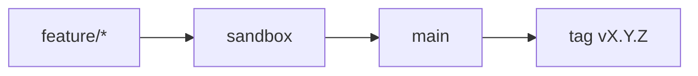

# Contributing

Obrigado por considerar contribuir com o portfólio open source de Kleilson dos Santos.

## Fluxo Git (obrigatório)

Guia completo: [`docs/guides/git-workflow.md`](./docs/guides/git-workflow.md) · kickoff: [`docs/guides/task-kickoff.md`](./docs/guides/task-kickoff.md)

**Nunca** commit direto em `main` ou `sandbox`.

## Como contribuir

1. Fork (ou clone com permissão)
2. Kickoff canônico (`task-kickoff.md`) — issue → In Progress → branch de `sandbox`
3. Commits: [Conventional Commits](https://www.conventionalcommits.org/) + Gitmoji (`type: <emoji> …`; merges: `merge: 🔀 PR #n — branch`). Hooks: `git config core.hooksPath .githooks`
4. Autoria: `Kleilson Santos <kdsddesign1@gmail.com>` — **sem** `Co-authored-by: Cursor` / trailers de IDE ([AGENTS.md](./AGENTS.md))
5. Antes do PR: `pnpm typecheck && pnpm lint && pnpm build`
6. Docs no mesmo PR se mudar build/test/uso/release/arquitetura ([ADR-0003](./docs/adr/0003-documentation-strategy.md))
7. PR → `sandbox` → depois PR `sandbox` → `main`
8. Release: CHANGELOG + bump + tag anotada ([releases.md](./docs/guides/releases.md))

## Prefixos de branch

`feature/` · `fix/` · `bugfix/` · `hotfix/` · `refactor/` · `docs/` · `test/` · `chore/` · `build/` · `ci/` · `perf/` · `style/`

## Agentes de IA

[`AGENTS.md`](./AGENTS.md) · [`docs/guides/ai-agentic.md`](./docs/guides/ai-agentic.md) · custom agents: [`.github/agents/`](./.github/agents/)

## Padrões

- Escopo mínimo por PR
- UI em pt-BR
- Não inventar fatos profissionais
- Consulte `docs/adr/` antes de mudança arquitetural

## Código de conduta

[CODE_OF_CONDUCT.md](./CODE_OF_CONDUCT.md)
