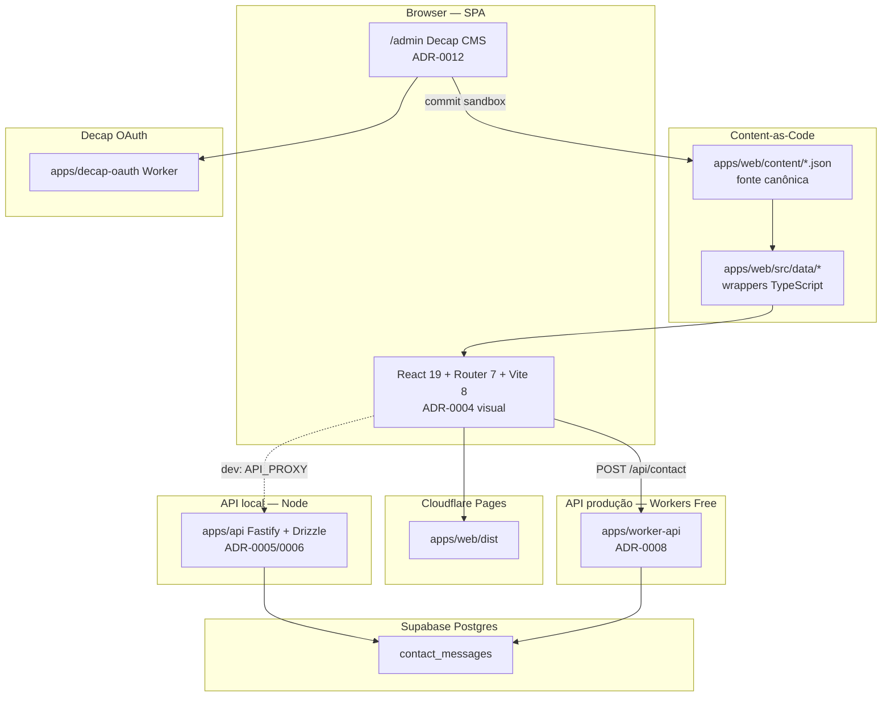

# Arquitetura — Visão Geral (atual: monorepo pnpm + Turborepo)

## Diagrama lógico

## Stack vigente

| Camada | Tecnologia |
|--------|------------|
| Monorepo | pnpm workspaces + Turborepo (ADR-0011) |
| UI | React 19 + React Router 7 (`apps/web`) |
| Build | Vite 8 → `apps/web/dist` |
| Linguagem | TypeScript (strict) |
| Estilo | CSS design tokens (ADR-0004) |
| Qualidade | oxlint + Vitest + Playwright + Lighthouse + CodeQL |
| Conteúdo | `apps/web/content/*.json` + wrappers `src/data/*` (ADR-0007 + ADR-0012) |
| Contato (dev) | Mock Vite `/api/contact` ou `apps/api` com `API_PROXY` |
| Contato (prod) | `apps/worker-api` (Workers Free) → PostgREST/Supabase |
| Contato (local full) | Fastify 5 + Drizzle em `apps/api` |
| CMS | Decap em `/admin` + OAuth Worker `apps/decap-oauth` |
| Deploy | Cloudflare Pages + Workers Free (ADR-0008); GitHub Pages = redirect legado |
| Shared | `packages/shared` (schema contato) |

## Princípios

- Conteúdo profissional só com evidência (CV / GitHub / LinkedIn)
- Narrativa = desired state no Git (`content/*.json`); Postgres só para mensagens de contato
- Sem admin JWT/`localStorage`/Firebase; editorial só Git-backed (ADR-0007/0012)
- Docs no mesmo PR quando build/test/uso/release/arquitetura mudam (ADR-0003)
- Wiki GitHub = mapa de links (não fonte canônica)
- Fluxo Git: `feature/* → sandbox → main` + SemVer

## Referências

- **[system-guide.md](./system-guide.md)** — guia completo de arquitetura e fluxos (estudo)
- [ADR-0001](../adr/0001-frontend-vite-react.md) — frontend
- [ADR-0002](../adr/0002-git-branching-strategy.md) — Git
- [ADR-0003](../adr/0003-documentation-strategy.md) — docs
- [ADR-0004](../adr/0004-visual-direction.md) — visual
- [ADR-0005](../adr/0005-fastify-contact-api.md) — API Fastify
- [ADR-0006](../adr/0006-supabase-drizzle-contact.md) — persistência contato
- [ADR-0007](../adr/0007-content-as-code.md) — Content-as-Code
- [ADR-0008](../adr/0008-cloudflare-deploy.md) — deploy Cloudflare
- [ADR-0011](../adr/0011-turborepo-pnpm.md) — monorepo
- [ADR-0012](../adr/0012-decap-cms-git-backed.md) — Decap
- [content.md](../guides/content.md) · [deploy.md](../guides/deploy.md) · [api.md](../guides/api.md) · [releases.md](../guides/releases.md)
