# Guia do Sistema — Arquitetura e Fluxos (kleilson-portfolio)

> **Fonte de estudo canônica** da arquitetura e do funcionamento do portfólio.  
> **Regra:** só o que o código/config/docs atuais comprovam. O que não existe está marcado como **Ainda não implementado.**  
> **Complementa** (não substitui): ADRs em `docs/adr/`, how-tos em `docs/guides/`, contrato em `AGENTS.md`.

| | |
| --- | --- |
| **Versão do guia** | 2026-07-12 |
| **Baseline de código** | monorepo pnpm + Turborepo; Pages + Workers Free; Decap |
| **Última release tag** | `v0.5.0` |
| **Site** | https://kleilson-portfolio.pages.dev |

---

## Sumário rápido (mapa mental)

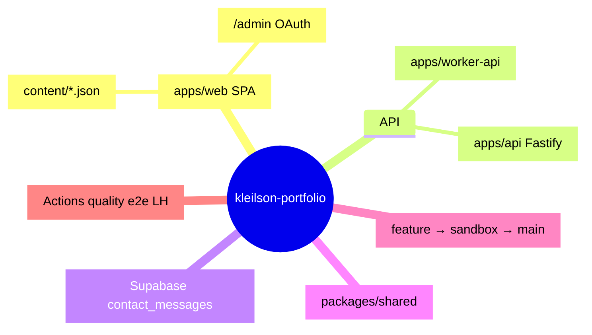

---

## 1. Visão geral do projeto

### O que é

Portfólio profissional **open source** de Kleilson dos Santos: site estático (SPA) + API de contato + conteúdo versionado no Git.

### Problema que resolve

Publicar experiência/projetos **auditáveis** (CV · GitHub · LinkedIn), com disciplina de engenharia (CI, ADRs, fluxo Git), sem inventar fatos e sem admin JWT legado.

### Objetivo

Site em produção (Cloudflare Pages), formulário de contato persistido (Supabase), editorial Git-backed (Decap), monorepo manutenível.

### Visão macro (ASCII)

```text
Visitante
   │
   ▼
Cloudflare Pages (SPA apps/web)
   │                    │
   │ conteúdo           │ POST /api/contact
   │ (JSON no build)    ▼
   │              Worker API (apps/worker-api)
   │                    │
   │                    ▼
   │              Supabase Postgres
   │              (contact_messages)
   │
   └── /admin (Decap) ──OAuth──► apps/decap-oauth ──► GitHub (branch sandbox)
```

### Mermaid — alto nível

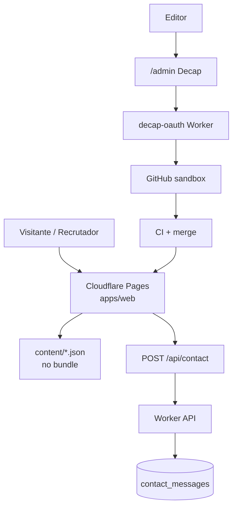
---

## 2. Arquitetura geral

### Pacotes do monorepo

Evidência: `pnpm-workspace.yaml`, `turbo.json`, `package.json` de cada app.

| Pacote | Path | Responsabilidade |
| --- | --- | --- |
| `@kleilson/web` | `apps/web` | SPA React 19 + Vite 8 + Decap static |
| `@kleilson/api` | `apps/api` | Fastify local (dev / futuro Containers) |
| `@kleilson/worker-api` | `apps/worker-api` | API **produção** Workers Free |
| `@kleilson/decap-oauth` | `apps/decap-oauth` | OAuth GitHub para Decap |
| `@kleilson/shared` | `packages/shared` | Schema/regras de contato compartilhadas |

### Quem fala com quem

| De | Para | Quando | Como | Por quê |
| --- | --- | --- | --- | --- |
| Browser | Pages CDN | sempre | HTTPS estático | servir UI |
| Contatos.tsx | `/api/contact` ou `VITE_API_BASE_URL` | submit formulário | `fetch` POST JSON | gravar mensagem |
| Worker | Supabase PostgREST | contact + health | HTTP + `service_role` | persistência prod |
| Fastify local | Postgres via Drizzle | se `DATABASE_URL` válido | SQL | persistência local |
| Decap | GitHub API | publish CMS | OAuth Worker | editar JSON no Git |
| Vite (dev) | mock `/api/contact` | sem `API_PROXY` | plugin Vite | E2E/preview sem API |

### Diagrama de deploy

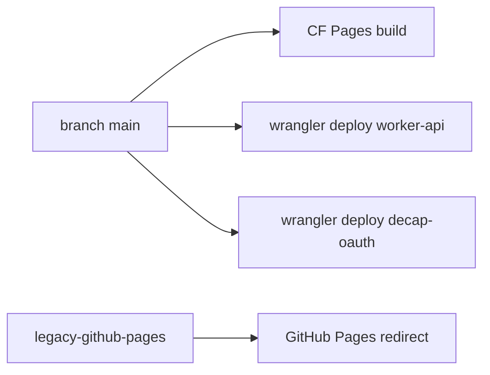

---

## 3. Fluxo completo da aplicação (boot do site)

Ordem cronológica ao abrir `https://kleilson-portfolio.pages.dev/`:

1. **CDN Pages** devolve `index.html` + assets de `apps/web/dist`.
2. Browser baixa JS; executa `apps/web/src/theme-boot.ts` (import em `main.tsx`) — aplica tema claro/escuro antes do paint (evita flash).
3. `main.tsx`: `initFrontendSentry()` — **no-op** se não houver `VITE_SENTRY_DSN`.
4. `createRoot(#root).render`:
   - `StrictMode`
   - `BrowserRouter`
   - opcional `Sentry.ErrorBoundary` se DSN
   - `<App />`
5. `App.tsx` monta `Routes` → `Layout` (outlet) + rota filha.
6. `Layout` renderiza nav + `<Outlet />` + `Footer`; usa `useTheme`, `useAnalytics`.
7. Página (ex. `Home`) importa dados de `src/data/*` (JSON embutido no bundle) e `useDocumentMeta`.

> **Não há** React Context / Provider de auth ou store global. Estado é local por página/hook.

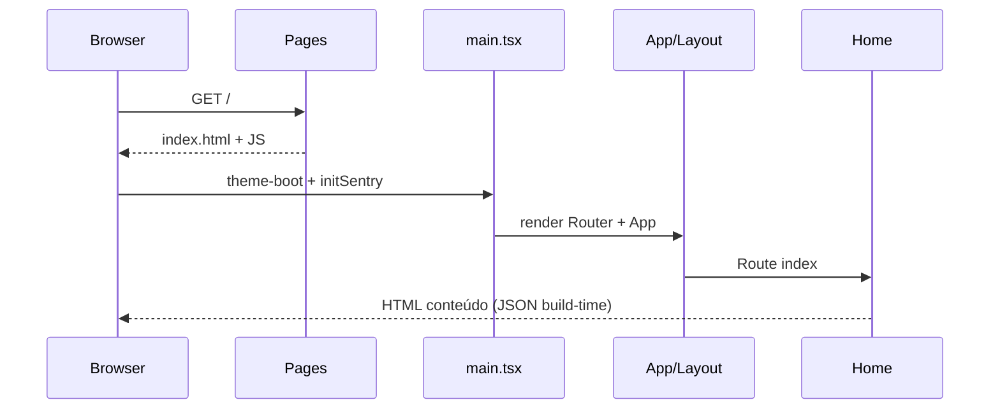

---

## 4. Fluxo de cada tela

### Rotas (`App.tsx`)

| Path | Página | Arquivo |
| --- | --- | --- |
| `/` | Home | `pages/Home.tsx` |
| `/sobre` | Sobre | `pages/Sobre.tsx` |
| `/projetos` | Projetos | `pages/Projetos.tsx` |
| `/contatos` | Contatos | `pages/Contatos.tsx` |
| `*` | 404 | `pages/NotFound.tsx` |

Todas sob `Layout` (exceto que 404 também usa Layout via rota `*`).

### Padrão comum por página

- **Entrada:** React Router navega → componente da página monta.
- **Hooks:** tipicamente `useDocumentMeta({ title, description, canonical })`.
- **Dados:** imports estáticos de `../data/*` (não HTTP).
- **HTTP:** só Contatos chama API.
- **Providers:** nenhum além do Router no `main`.
- **Loading/erro HTTP:** só no formulário de Contatos (`status`: idle/loading/success/error).

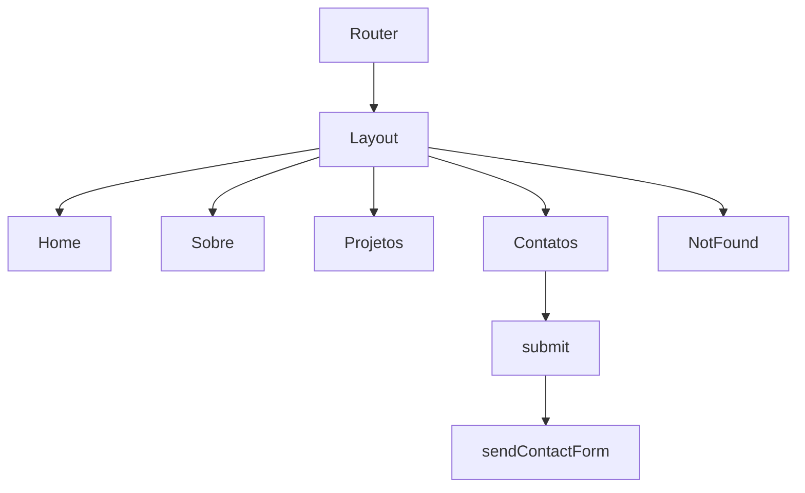

### Contatos (única tela com HTTP)

1. Estado local: `form`, `errors`, `status`, `message`.
2. `updateField` → `validateField`.
3. Submit → `validateForm` → se ok → `sanitizeFormData` → `sendContactForm`.
4. Sucesso: limpa form; erro: mensagem genérica + fallback e-mail.

Evidência: `apps/web/src/pages/Contatos.tsx`, `api/contact.ts`, `utils/validation.ts`, `utils/sanitize.ts`.

---

## 5. Fluxo de componentes

### Árvore real

```text
main.tsx
└── BrowserRouter
    └── App (Routes)
        └── Layout
            ├── nav (links + toggle tema)
            ├── Outlet → página ativa
            │     ├── Home (+ ProfilePhoto)
            │     ├── Sobre
            │     ├── Projetos
            │     ├── Contatos (form)
            │     └── NotFound
            └── Footer
```

| Componente | Quem usa | Props / papel |
| --- | --- | --- |
| `Layout` | `App` rota pai | Outlet, nav, tema, analytics |
| `Footer` | `Layout` | links sociais / copy |
| `ProfilePhoto` | `Home` (e possivelmente Sobre) | avatar WebP |

> **Atomic Design / Design System package:** Ainda não implementado. Tokens CSS em `apps/web/public/design-tokens.css` (ADR-0004) — fonte única para o site (`src/index.css`) e o editorial Decap (`public/admin/admin.css`).

---

## 6. Fluxo dos hooks

| Hook | Arquivo | Onde | Quando | Retorno / efeito |
| --- | --- | --- | --- | --- |
| `useTheme` | `hooks/useTheme.ts` | `Layout` | mount + toggle | tema + `localStorage` + `dataset.theme` |
| `useDocumentMeta` | `hooks/useDocumentMeta.ts` | páginas | mount/update | `document.title` + meta tags |
| `useAnalytics` | `hooks/useAnalytics.ts` | `Layout` | navegação | pageview Umami se env set |

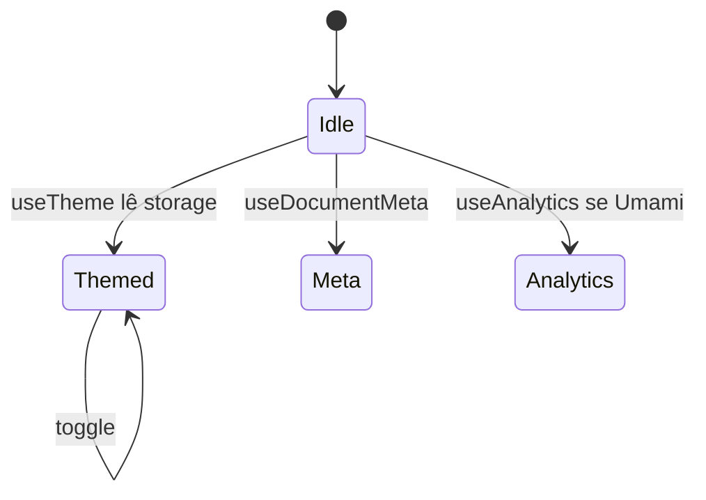

---

## 7. Fluxo dos Contexts

> **Ainda não implementado** React Context / Provider de domínio.

Tema = hook + util (`utils/theme.ts`) + boot script — não Context.

---

## 8. Fluxo da autenticação

### Visitante do site

> **Ainda não implementado:** login JWT, sessão, rotas protegidas, interceptor Axios, Firebase.

O portfólio é **público**. Sem auth de visitante.

### Editorial (Decap)

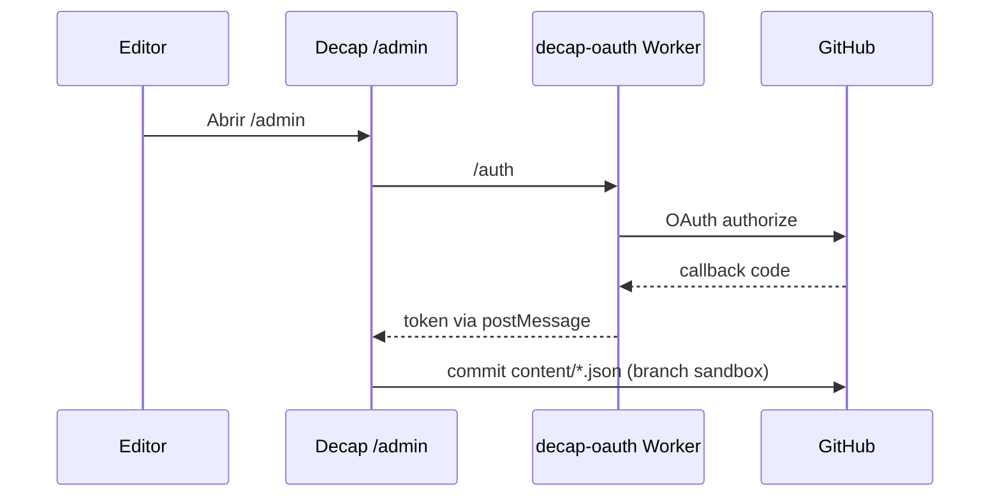

Evidência: `apps/decap-oauth/src/index.ts`, `apps/web/public/admin/config.yml` (`base_url` OAuth Worker, backend GitHub, branch `sandbox`).

---

## 9. Fluxo das chamadas HTTP

### Endpoints reais

| Método | Path | Quem serve | Quem chama |
| --- | --- | --- | --- |
| `POST` | `/api/contact` | Worker prod / Fastify local / mock Vite | `sendContactForm` |
| `GET` | `/health` | Worker / Fastify | smoke, uptime, CI manual |
| `OPTIONS` | `/health`, `/api/*` | Worker | CORS preflight |
| `GET` | `/`, `/health` | decap-oauth | health do OAuth |
| `GET` | `/auth`, `/callback` | decap-oauth | Decap login |

### Contato — payload

- **Body:** `{ name, email, category?, message }` (schema em `packages/shared`)
- **Headers:** `Content-Type: application/json`
- **Resposta sucesso:** JSON da API (Fastify/Worker); cliente Contatos só checa sucesso vs throw
- **Retry / timeout configurável no client:** Ainda não implementado (fetch nativo sem retry)
- **Rate limit:** Fastify global + mais estrito na rota contact; Worker depende de plataforma / PostgREST

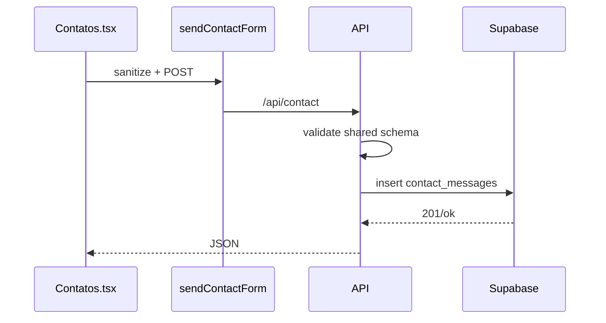

---

## 10. Fluxo da persistência (contato)

### Produção

```text
Contatos → sendContactForm → Worker handleContact
  → PostgREST POST /rest/v1/contact_messages
  → service_role (bypassa RLS)
```

### Local com DB

```text
Contatos → (proxy) → Fastify routes/contact
  → assertContactBusinessRules + schema
  → store/index → drizzle.ts → DATABASE_URL
```

### Local sem DB / test

```text
store/memory.ts
```

### Caminho inverso (leitura lista HTTP)

> **Ainda não implementado:** `listContacts` existe no store Fastify, **sem rota HTTP** pública.

Não há “Use Case / Repository / Controller” em pastas Clean Architecture — Fastify **routes** + **store** + **db**.

---

## 11. Fluxo do Supabase

| Capacidade | Status |
| --- | --- |
| Postgres `contact_messages` | ✅ usado |
| Auth de usuários do site | ❌ Ainda não implementado |
| Storage de arquivos | ❌ Ainda não implementado |
| Realtime | ❌ Ainda não implementado |
| RLS | ✅ documentado (ADR-0006); policies **não** versionadas neste repo; escritas via `service_role` no Worker |
| Migrations no repo | ❌ Ainda não implementado (schema Drizzle local; tabela criada no projeto Supabase) |

---

## 12. Fluxo do banco de dados

### Entidade (Drizzle — `apps/api/db/schema.ts`)

Tabela **`contact_messages`**:

| Coluna | Tipo |
| --- | --- |
| `id` | uuid |
| `name` | text |
| `email` | text |
| `category` | text |
| `message` | text |
| `created_at` | timestamp |

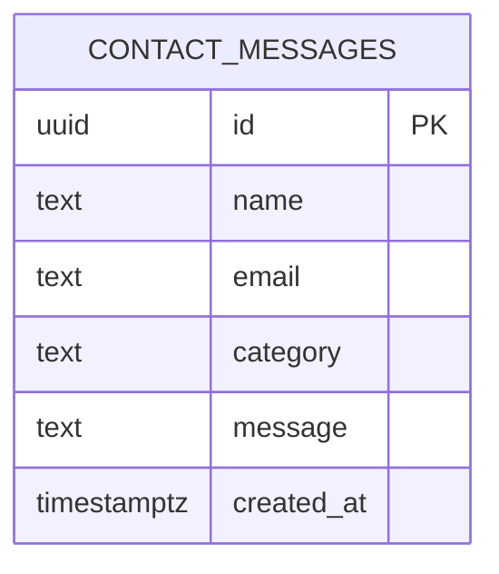

Relacionamentos: nenhum (tabela única).

---

## 13. Fluxo da infraestrutura

| Item | Status |
| --- | --- |
| Cloudflare Pages | ✅ SPA |
| Cloudflare Workers (API + OAuth) | ✅ |
| `apps/api/Dockerfile` | ✅ arquivo existe; path **pago futuro** (Containers) |
| docker-compose | ❌ Ainda não implementado |
| Rede/volumes Compose | ❌ N/A |
| Variáveis | `.env` raiz (local); secrets Wrangler; `VITE_*` no build Pages |

---

## 14. Fluxo da observabilidade

| Peça | Status | Evidência |
| --- | --- | --- |
| `GET /health` | ✅ | Fastify + Worker |
| Sentry frontend/API | 🟡 opt-in (no-op sem DSN) | `observability/sentry.ts` |
| Sentry Worker | ❌ omitido (ADR-0009 / comentário no Worker) |
| Umami | 🟡 opt-in | `observability/analytics.ts` |
| Workers Observability | ✅ wrangler | logs CF |
| Prometheus / Grafana / OTel app | ❌ Ainda não implementado (Grafana opcional no ROADMAP #62) |

---

## 15. Fluxo do CI/CD

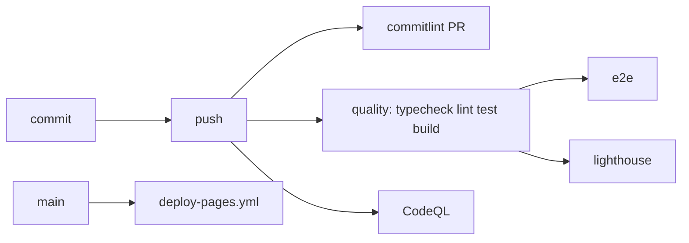

| Workflow | Gatilho | Jobs |
| --- | --- | --- |
| `ci.yml` | push/PR sandbox+main | commitlint, quality, e2e, lighthouse |
| `deploy-pages.yml` | main | build web → Pages |
| `legacy-github-pages-redirect.yml` | paths legacy | GitHub Pages redirect |
| `codeql.yml` | schedule/push | analyze |

Release SemVer: processo humano (`docs/guides/releases.md`) — tag anotada + GitHub Release; **não** há Action que tague automaticamente.

Git flow:

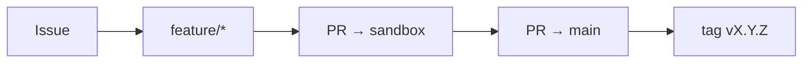

---

## 16. Estrutura de pastas (árvore útil)

```text
kleilson-portfolio/
├── apps/
│   ├── web/                 # SPA + Decap public/admin + content/
│   ├── api/                 # Fastify + Drizzle + store
│   ├── worker-api/          # Worker prod
│   └── decap-oauth/         # OAuth Decap
├── packages/shared/         # contact schema
├── docs/adr|architecture|guides/
├── legacy-github-pages/     # redirect legado
├── .github/workflows|agents|prompts|instructions/
├── AGENTS.md
├── pnpm-workspace.yaml
└── turbo.json
```

Pastas **não** presentes de propósito: `docs/api/` (how-to = `guides/api.md`), `server/`, `workers/api` (migrados).

---

## 17. Fluxo interno por diretório (imports)

### Web

```text
pages/* → data/* → content/*.json
pages/Contatos → api/contact → fetch
Layout → hooks/useTheme|useAnalytics → utils/theme | observability/analytics
```

### API

```text
index.ts → app.ts → routes/* → store/* → db/* 
routes/contact → @kleilson/shared
```

### Worker

```text
index.ts → @kleilson/shared (assertContactBusinessRules + schema)
         → fetch Supabase REST (service_role)
```

---

## 18. Dependências principais

| Lib | Onde | Por quê |
| --- | --- | --- |
| React 19 / react-router 7 | web | UI + rotas |
| Vite 8 | web | build/dev |
| Fastify 5 | api | HTTP local |
| Drizzle + postgres | api | ORM local |
| Zod/schema JSON shared | shared | validação contato |
| Wrangler | workers | deploy CF |
| Decap CMS (CDN admin) | public/admin | editorial |
| Vitest / Playwright / Lighthouse | web(+api) | qualidade |
| Sentry SDK | web/api | erros opt-in |
| oxlint | root | lint |

Documentação oficial: React, Vite, Fastify, Drizzle, Cloudflare Pages/Workers, Decap, pnpm, Turborepo.

---

## 19. Padrões utilizados (só os reais)

| Padrão | Presente? | Onde |
| --- | --- | --- |
| Content-as-Code | ✅ | `content/*.json` + PRs |
| Monorepo workspaces | ✅ | pnpm + turbo |
| Shared kernel (contato) | ✅ | `packages/shared` |
| Route handlers (Fastify) | ✅ | `apps/api/routes` |
| Store selector (drizzle/memory) | ✅ | `apps/api/store` |
| Git branching sandbox | ✅ | ADR-0002 |
| Clean Architecture pastas | ❌ | Ainda não |
| Repository Pattern formal | 🟡 | store ≈ repo simples |
| DI container | ❌ | Ainda não |
| Atomic Design | ❌ | Ainda não |
| JWT AuthN site | ❌ | Ainda não |

---

## 20. Fluxo completo de uma requisição (contato)

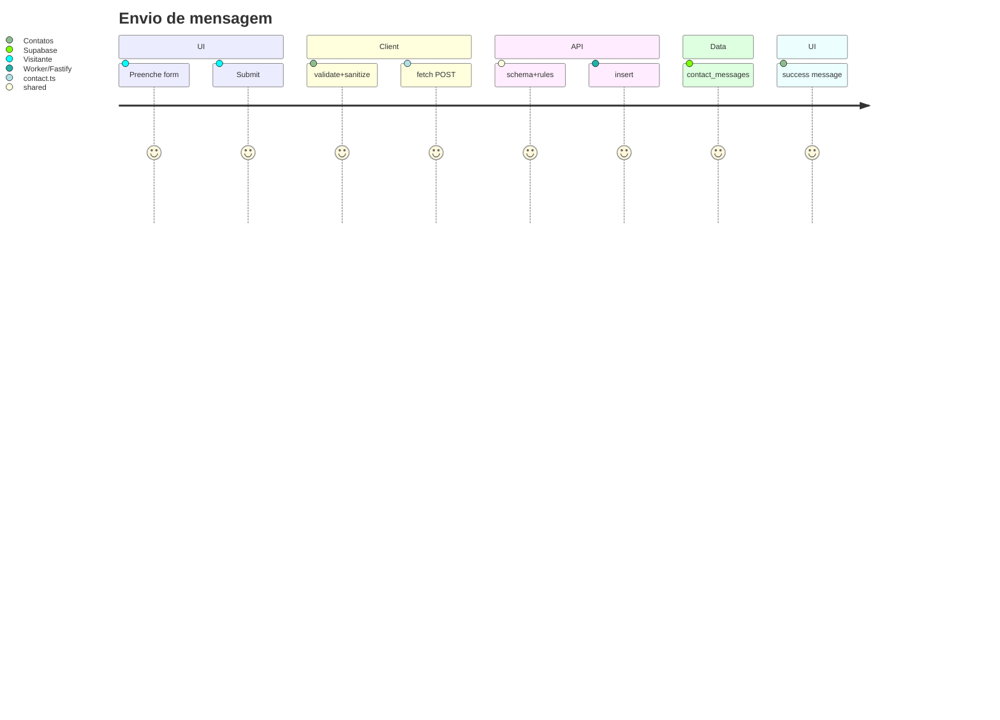

---

## 21. Fluxo de renderização React (neste projeto)

1. **Mount:** `createRoot` uma vez em `main.tsx`.
2. **Render:** `App` → `Layout` → página.
3. **Re-render:** mudanças de estado local (`useState` em Contatos/Layout tema) ou navegação Router.
4. **Effects:** hooks de meta/analytics/tema.
5. **StrictMode:** ativo (double-invoke effects em dev).

Virtual DOM / Diff: comportamento padrão React 19 — sem lib de estado externa.

---

## 22. Fluxo de estados

| Estado | Dono | Quem altera | Quem lê |
| --- | --- | --- | --- |
| Tema | `useTheme` / localStorage | toggle nav | Layout CSS |
| Form contato | `Contatos` | inputs/submit | inputs + status UI |
| Meta document | `useDocumentMeta` | props página | `<head>` |
| Router location | React Router | links/nav | rotas |

Sem Redux/Zustand/Jotai.

---

## 23. Fluxo de eventos

| Evento | Onde | Efeito |
| --- | --- | --- |
| Click nav | Layout | navigate |
| Toggle tema | Layout | `useTheme` |
| Submit form | Contatos | POST API |
| Change inputs | Contatos | validação campo |
| Resize/scroll/hover custom JS | — | Ainda não (CSS/responsive) |

---

## 24. Dependências entre módulos (mapa)

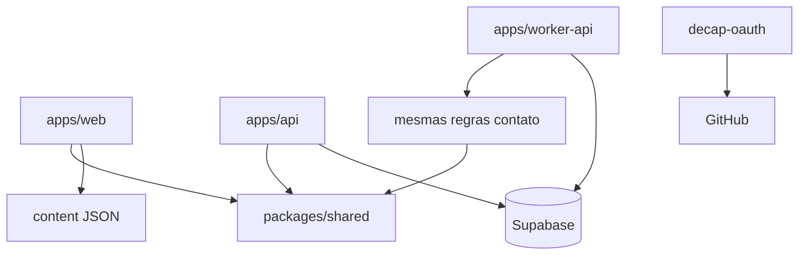

---

## 25. Linha do tempo do projeto

Evidência: tags em `docs/guides/releases.md` + ROADMAP + CHANGELOG.

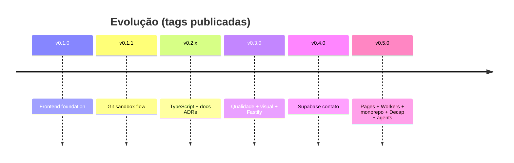

---

## 26. Estado atual

| Área | Status |
| --- | --- |
| SPA páginas + conteúdo JSON | ✅ |
| Formulário contato → persistência | ✅ (prod Worker) |
| Health checks | ✅ |
| Decap + OAuth | ✅ (setup secrets humanos) |
| Monorepo pnpm/turbo | ✅ |
| CI quality/e2e/LH/CodeQL | ✅ |
| Deploy Pages + Workers | ✅ |
| Sentry / Umami | 🟡 opt-in |
| Auth visitantes | ⚪ Ainda não |
| Grafana | ⚪ ROADMAP opcional |
| Containers Fastify prod | ⚪ futuro pago |
| Tag SemVer `v0.5.0` | ✅ |

---

## 27. Débito técnico (factual)

- Schema Supabase / RLS **não** versionados como migrations no Git.
- `listContacts` sem API HTTP.
- Dois paths de API (Worker vs Fastify) para manter até same-origin/domínio custom.
- CHANGELOG alinhado à tag `v0.5.0` (Fase 4+5).
- Sentry ausente no Worker.

---

## 28. Próximos passos (só fontes existentes)

Com base em `docs/ROADMAP.md` / issues docs:

- [ ] Grafana Cloud — opcional (#62), só com tráfego real
- [x] Tag SemVer promovendo Unreleased (`docs/guides/releases.md`) — `v0.5.0`
- [ ] Domínio custom / same-origin API (`docs/guides/deploy.md`)
- [ ] Containers pagos se/quando Workers Paid (ADR-0008)

> Não inventar features além destas fontes.

---

## Referências cruzadas

| Precisa de | Vá para |
| --- | --- |
| Decisão “por quê” | `docs/adr/*` |
| Como fazer | `docs/guides/*` |
| Admin editorial + operacional | [admin-operations.md](../guides/admin-operations.md) |
| Contrato agentes | `AGENTS.md` |
| Overview curto | [overview.md](./overview.md) |
| Wiki (só links) | https://github.com/KleilsonSantos/kleilson-portfolio/wiki |

---

*Fim do guia. Em caso de conflito entre este arquivo e o código, o código + ADRs vencem — abra PR corrigindo o drift (ADR-0003).*
