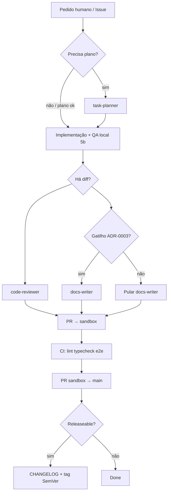
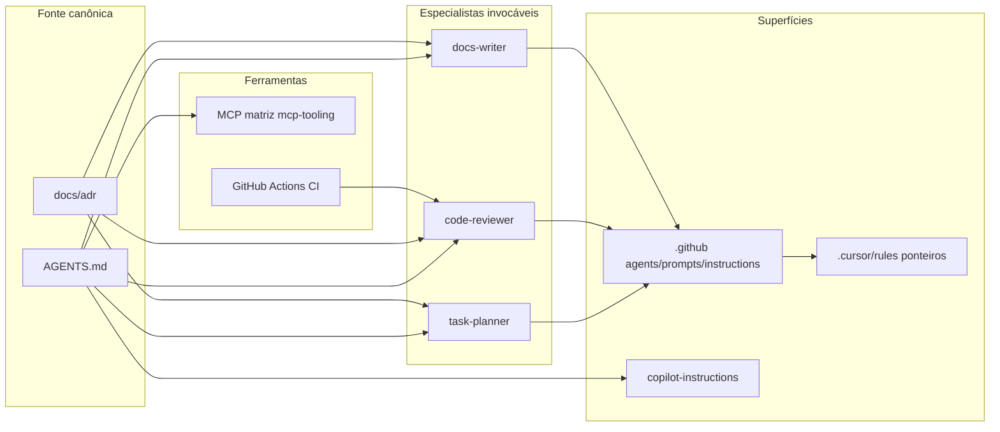

# Auditoria — Arquitetura de Agentes, Contexto e Governança de IA

- **Data:** 2026-07-13  
- **Escopo:** repositório `KleilsonSantos/kleilson-portfolio` (estado observado na árvore Git local / `sandbox`)  
- **Método:** inventário de arquivos + cruzamento com `AGENTS.md`, ADR-0003, `docs/guides/ai-agentic.md`, `docs/guides/mcp-tooling.md`  
- **Prompt de origem:** arquitetura de agentes especializados + governança (não um agente nominal `doc-research`)

> **Legenda:** **Fato** = observado no repo · **Limitação** = fora do escopo desta passagem · **Recomendação** = proposta justificada (YAGNI / SRP).

---

## 1. Resumo Executivo

O projeto **já tem** uma arquitetura de agentes enxuta e bem alinhada a boas práticas: contrato único (`AGENTS.md`), três especializações (`task-planner`, `code-reviewer`, `docs-writer`), espelhos finos no Cursor (sem copiar corpo dos prompts), política MCP explícita e documentação Diátaxis + ADR.

**Não existe** agente chamado `doc-research`. O papel de documentação **já é coberto** por `docs-writer` + ADR-0003 + `documentation-sync.md`. Criar um quarto agente “só docs research” seria **sobreposição** (YAGNI).

Principais gaps (prioridade ↓):

| Prio | Gap | Impacto |
| --- | --- | --- |
| P0 | MCPs disponíveis no **Cursor IDE do autor** (Vercel, GitLab, Datadog…) vs matriz **canônica do repo** (`mcp-tooling.md`) | Agentes podem usar ferramentas “proibidas” por disponibilidade local |
| P1 | Orquestração **event-based** ainda é **manual** (`@prompt-*` / Agents tab), sem pipeline CI de agentes | Consistência depende de disciplina humana |
| P1 | Gate **QA local (5b)** documentado em PR aberto (#144) — ainda não em `sandbox`/`main` nesta auditoria | Drift visual/funcional (ex.: `/admin`) |
| P2 | Sem `CLAUDE.md` / `GEMINI.md` — **OK** (evitar duplicar `AGENTS.md`); falta só um parágrafo de precedência multi-tool | Harmonização multi-IDE |
| P2 | Prompt reutilizável de **auditoria periódica de governança de IA** (este documento) ainda não versionado como `.prompt.md` | Recorrência |

**Conclusão:** consolidar e orquestrar o que existe > inventar agentes novos.

---

## 2. Inventário dos Agentes Existentes

### 2.1 Custom agents (GitHub Agents / Copilot)

| ID (fato) | Arquivo | Responsabilidade | Quando / quem aciona | Consome | Produz | Limitações |
| --- | --- | --- | --- | --- | --- | --- |
| **task-planner** | `.github/agents/task-planner.agent.md` | Planejar (não implementar) | Humano / aba Agents / `@` | `AGENTS.md`, issues, ADRs | Plano + aceite | tools: read/search only |
| **code-reviewer** | `.github/agents/code-reviewer.agent.md` | Revisar diff/PR | Humano após diff | Diff, ADRs, `AGENTS.md` | Veredito + bloqueadores | Não reescreve PR inteiro |
| **docs-writer** | `.github/agents/docs-writer.agent.md` | Docs/CHANGELOG/ADR alinhados ao código | Humano antes do PR / pós-diff | Diff, ADR-0003 | Edits em docs | Não inventa versões/tags |

Cada um **aponta** para o prompt espelho em `.github/prompts/*.prompt.md` e obriga `AGENTS.md`.

### 2.2 Prompts reutilizáveis

| Prompt | Arquivo | Papel |
| --- | --- | --- |
| task-planner | `.github/prompts/task-planner.prompt.md` | Canônico do planner |
| code-reviewer | `.github/prompts/code-reviewer.prompt.md` | Canônico do reviewer |
| docs-writer | `.github/prompts/docs-writer.prompt.md` | Canônico do docs |

### 2.3 Cursor rules (projeção — sem duplicar política)

| Rule | alwaysApply / @ | Papel |
| --- | --- | --- |
| `agents-canonical.mdc` | always | Aponta para `AGENTS.md` / ai-agentic / Copilot |
| `project-context.mdc` | always | Stack + estrutura |
| `git-workflow.mdc` | always | Fluxo Issue → sandbox → main |
| `prompt-*.mdc` | manual @ | **Só** `@.github/prompts/…` |
| `typescript-react` / `content-data` / `docs` / `routing-pages` | globs | Specs path-scoped |

### 2.4 Agentes que **não** existem (fato)

- `doc-research`, `security-reviewer` persistente no repo, `release-manager` agent, `CLAUDE.md` agent, orquestrador CI de LLM.

**Avaliação:** ausência ≠ gap automático. Ver §12–13.

---

## 3. Inventário dos MCPs

### 3.1 Política do repositório (fato — `docs/guides/mcp-tooling.md`)

| Usar | Não usar (neste repo) |
| --- | --- |
| Supabase, Postman (se auth), Grafana (opcional tráfego), Sonar/Snyk (fase explícita) | Vercel deploy, GitLab, Datadog; HF/Figma/Miro/Slack/Notion/Atlassian salvo pedido pontual |

Write ops MCP: **só** com pedido humano explícito.

### 3.2 MCPs observados no ambiente Cursor do autor (limitação: workspace host ≠ repo)

Fato de sessão: o host Cursor expõe plugins (ex.: Vercel, GitLab, Datadog, Notion…).  
**Conflito potencial:** disponibilidade IDE ≠ permissão de projeto (`mcp-tooling.md` + `AGENTS.md`).

**Recomendação:** agents devem **consultar a matriz do repo primeiro**; ignorar MCP “presente” se estiver na coluna Não usar.

Não há `.cursor/mcp.json` / `.mcp.json` versionado no repo (fato) — governança MCP é documental, não config commitada.

---

## 4. Inventário das Instruções e Prompts

| Artefato | Função | Precedência |
| --- | --- | --- |
| `AGENTS.md` | Contrato IDE-agnóstico | **#1** |
| ADRs `docs/adr/` | Decisões obrigatórias | Empata com código; vence sugestão do modelo |
| `.github/copilot-instructions.md` | Espelho curto Copilot | Derivado de AGENTS |
| `.github/instructions/*.instructions.md` | `applyTo` path-scoped | Complementar |
| `.github/prompts/*.prompt.md` | Papéis invocáveis | Especialização |
| `.github/agents/*.agent.md` | Wrapper Agents tab | Aponta para prompts + AGENTS |
| `.cursor/rules/*.mdc` | Globs / always / @ | Só ponteiros finos |
| `README.md` / `docs/guides/*` | Humanos + agentes | Operacional |
| Wiki GitHub | Mapa de links | **Não** canônico |

**Ausentes (fato):** `CLAUDE.md`, `GEMINI.md`, `.cursorrules` (deprecado — não usar).

---

## 5. Auditoria da Documentação

### Estrutura (fato)

```text
docs/
  adr/             # decisões
  architecture/    # overview + system-guide
  guides/          # how-to (Diátaxis)
  audits/          # auditorias pontuais (este arquivo)
```

~31 markdowns em `docs/`. Guias com `## Relacionados` (política ADR-0003 / documentation-sync).

### Achados

| Tipo | Achado | Classificação |
| --- | --- | --- |
| Completude | Fluxo docs (ADR-0003 + documentation-sync) maduro | Forte |
| Risco | Dois audits grandes anteriores + este — audits podem envelhecer | Processo: datar + linkar de overview |
| Drift | Guides vs código (ex.: tokens em `public/design-tokens.css`) precisa sync contínuo | Já coberto por docs-writer + ADR-0003 |
| Wiki | Explicitamente não canônica | Correto |
| Gate QA local | Passo 5b em PR #144 (não necessariamente em `sandbox` nesta data) | **Limitação temporal** |

Não foram encontrados arquivos `.md` vazios (0 bytes) no inventário rápido.

---

## 6. Auditoria da Estrutura de Pastas (IA / Docs)

| Pasta | Avaliação |
| --- | --- |
| `.github/agents` + `prompts` + `instructions` | Clara, escala bem, SRP entre papéis |
| `.cursor/rules` | Ponteiros — aderente a “não duplicar” |
| `docs/{adr,guides,architecture,audits}` | Intuitiva Diátaxis |
| Conteúdo site `apps/web/content` | Separado de docs (certo) |

**Profundidade:** ok. Não recomendar design-system package só para agentes (YAGNI — system-guide já declara ausência de Atomic Design package).

---

## 7. Auditoria da Base de Conhecimento

| Pergunta | Resposta |
| --- | --- |
| Conhecimento duplicado? | **Controlado:** Copilot instructions espelha AGENTS (resumo); agents não re-copiam contratos longos |
| Conflitante? | Risco MCP host vs matriz repo (P0 acima) |
| Sem utilização? | Instructions path-scoped — ok se Copilot `applyTo` ativo |
| Sem referência? | Audits antigos: linkar em `docs/architecture/overview.md` se ainda não |
| Consolidar? | Manter triade planner/reviewer/docs; não fundir num “super-agent” |

---

## 8. Redundâncias e Duplicidades

| Par | Status | Ação |
| --- | --- | --- |
| `*.agent.md` ↔ `*.prompt.md` | Espelho **intencional** (GitHub vs prompt file) | Manter; agentes só apontam |
| `prompt-*.mdc` ↔ prompts | Ponteiro `@` | Manter |
| `copilot-instructions` ↔ `AGENTS.md` | Resumo vs contrato | Manter; AGENTS vence |
| Novo `doc-research` ↔ `docs-writer` | **Sobreposição** | **Não criar** |
| MCP Vercel (IDE) ↔ Cloudflare (ADR-0008) | Conflito de caminho | Agents: recusar / matriz |

---

## 9. Matriz de Responsabilidades dos Agentes

| Agente | Responsabilidade | Entradas | Saídas | Dependências | Critério execução | Prioridade | Frequência | Impacto |
| --- | --- | --- | --- | --- | --- | --- | --- | --- |
| task-planner | Planejar | Issue/pedido | Plano + aceite | AGENTS, ADRs | Início de tarefa | Alta | Por feature | Escopo/Git corretos |
| code-reviewer | Revisar | Diff/PR | Veredito | AGENTS, ADR-0004 | Pós-implementação / PR | Alta | Por PR | Qualidade/segurança conteúdo |
| docs-writer | Sync docs | Diff + ADR-0003 | Docs/CHANGELOG | documentation-sync | Antes do PR se gatilho ADR-0003 | Alta | Por PR doc-worthy | Anti-drift |
| *(humano + CI)* | Lint/typecheck/e2e | Código | Gates verdes | workflows | Sempre no PR | Crítica | Todo PR | Não substituível por LLM |
| *(proposto: audit prompt)* | Auditoria periódica governança IA | Repo tree | Relatório `docs/audits/` | Este doc | Trimestral / pós-mudança de agents | Média | Rara | Governança |

---

## 10. Fluxo de Orquestração Inteligente



**Regra:** nunca acionar os três agents em paralelo “por padrão”. Ordem: **planner (opcional) → código → reviewer → docs se gatilho**.

---

## 11. Pipeline de Execução Baseado em Eventos

| Evento | Agents / ações |
| --- | --- |
| Issue In Progress / kickoff | task-planner (opcional) + branch `feature/*` from sandbox |
| Código alterado | QA local 5b (humano/agente implementador) |
| Diff pronto | code-reviewer |
| Mudança build/test/uso/release/arquitetura | docs-writer (obrigatório) |
| Só tipagem/refactor interno | sem docs-writer |
| PR aberto | CI (não LLM); humano/revisão |
| Merge main releaseable | releases.md (humano) — **sem** agent novo ainda |
| Mudança em `.github/agents` / prompts / AGENTS | Rodar audit prompt (este) |

---

## 12. Recomendações de Novos Agentes (só se justificadas)

| Proposta | Criar? | Justificativa |
| --- | --- | --- |
| `doc-research` | **Não** | Sobreposição com docs-writer + ADR-0003; nome frágil |
| Agent de segurança persistente | **Não agora** | CodeQL + code-reviewer checklist + Sonar/Snyk opcional; AI “security agent” sem pipeline = teatro |
| Agent release-manager | **Não agora** | `releases.md` + humano é suficiente (baixo volume de releases) |
| **Prompt** `ai-governance-audit` (não agent) | **Sim** | Auditoria periódica sem processo residente; SRP claro; acionado sob demanda |

**Princípio:** preferir **prompt reutilizável** + invocação humana a proliferar `*.agent.md`.

---

## 13. Consolidação / Remoção

| Item | Ação |
| --- | --- |
| Triade atual | **Manter** |
| Espelhos Cursor | **Manter** (não absorver corpo dos prompts) |
| Qualquer fork CLAUDE.md com cópia de AGENTS | **Evitar** — linkar `AGENTS.md` se um dia criar stub |
| MCPs fora da matriz | **Não versionar** no repo; disciplina de prompt |

---

## 14. Roadmap de Implementação

| Fase | Entrega | Esforço | Risco |
| --- | --- | --- | --- |
| A | Versionar prompt `ai-governance-audit.prompt.md` + pointer Cursor `@` | Baixo | Baixo |
| A | Linkar audits em `docs/architecture/overview.md` | Baixo | Baixo |
| B | Merge gate QA local 5b (#144) → sandbox → main | Baixo | Já validado local |
| B | Parágrafo “Precedência multi-tool” em `ai-agentic.md` (CLAUDE/GEMINI → AGENTS) | Baixo | Baixo |
| C | Reminder no `code-reviewer` checklist: “MCP usado está na matriz?” | Baixo | Baixo |
| D | (Opcional) Skills Cursor só se ganho recorrente | Médio | Overengineering |

---

## 15. Checklist de Governança de IA

- [ ] `AGENTS.md` é a única fonte normativa de política  
- [ ] Agents/prompts/instructions apontam; não triplicam texto  
- [ ] MCP: matriz do **repo** > MCP instalado no IDE  
- [ ] Write via MCP só com pedido humano  
- [ ] Agents acionados por evento, não “todos sempre”  
- [ ] QA local antes de push (Passo 5b)  
- [ ] Sem trailers de co-autoria de IDE  
- [ ] Auditoria de governança IA revisada periodicamente  

---

## 16. Checklist de Governança da Documentação

- [ ] Gatilhos ADR-0003 / documentation-sync (**cadência A** — mesmo PR)  
- [ ] Release: Unreleased → `[X.Y.Z]` + tag + GitHub Release (**cadência B**)  
- [ ] Última tag SemVer alinhada a `package.json` / CHANGELOG (sem drift)  
- [ ] CHANGELOG Keep a Changelog 1.1.0 (incl. Deprecated/Removed quando couber)  
- [ ] Wiki = mapa, não canônico  
- [ ] Docs-writer só quando há gatilho A; research-only agent **não** necessário  
- [ ] Audits datados em `docs/audits/`  
- [ ] Diagramas Mermaid em guides/architecture quando ajudam TDAH/escanabilidade  

---

## 17. Fluxograma Geral da Arquitetura dos Agentes



---

## 18. Referências Oficiais / Práticas Utilizadas

| Tema | Fonte |
| --- | --- |
| Docs when to update | [Google eng-practices — Documentation](https://google.github.io/eng-practices/review/reviewer/looking-for.html) |
| DoD docs | [Microsoft Engineering Playbook — Definition of Done](https://microsoft.github.io/code-with-engineering-playbook/agile-development/team-agreements/definition-of-done/) |
| ADR | Nygard (ADR-0003 do repo) |
| Diátaxis | [diataxis.fr](https://diataxis.fr/) (via documentation-sync) |
| Changelog | [Keep a Changelog](https://keepachangelog.com/) |
| Cursor AGENTS/rules | [Cursor Docs — Rules / AGENTS.md](https://cursor.com/docs/rules) |
| MCP tools + consent | [MCP — Server concepts / Tools](https://modelcontextprotocol.io/docs/learn/server-concepts) |
| MCP architecture | [MCP specification — Architecture](https://modelcontextprotocol.io/specification/2025-11-25/architecture) |
| Repo | `AGENTS.md`, `docs/guides/ai-agentic.md`, `docs/guides/mcp-tooling.md`, ADR-0002/0003 |

---

## Anexo A — Arquitetura de Contexto (Context Engineering)

### Hierarquia de precedência (recomendada)

```text
1. Código + ADRs + apps/web/content (fatos)
2. AGENTS.md
3. docs/guides relevantes ao pedido (lazy: só o guia necessário)
4. Prompt/agent especializado invocado
5. copilot-instructions / rules alwaysApply (resumo)
6. MCP results (verificados; matriz do repo)
```

### Lazy context loading

| Pedido | Carregar |
| --- | --- |
| Feature kickoff | AGENTS + task-kickoff + ADR tocado |
| Review CSS/admin | AGENTS + ADR-0004 + admin paths |
| SQL/contact | AGENTS + mcp-tooling + ADR-0006 |
| “Auditar agentes” | Este audit + ai-agentic + agents/*.md |

### Prevenção de duplicidade

- Cursor: **ponteiros** only (`agents-canonical`, `prompt-*`)  
- Não criar `CLAUDE.md`/`GEMINI.md` com cópia integral — se necessário, 5 linhas + link `AGENTS.md`  
- Copilot instructions permanece **espelho curto**

### Versionamento de prompts

- Conventional Commits em mudanças de `.github/prompts` / `agents`  
- CHANGELOG `[Unreleased]` se mudar comportamento para contribuidores humanos  

---

## Anexo B — Decisão sobre agente de documentação

**Pergunta:** faz sentido um agente exclusivo de “research/docs QA”?

| Critério | Avaliação |
| --- | --- |
| SRP | `docs-writer` já é SRP para sync doc↔código |
| Ganho real de research separado | Baixo neste monorepo (docs pequenos, ADR-0003 forte) |
| Overlap | Alto com docs-writer + audits manuais |
| Alternativa | Prompt periódico `ai-governance-audit` + docs-writer em PRs |

**Decisão desta auditoria:** **não** criar `doc-research`; **sim** versionar prompt de governança + manter `docs-writer`.

---

*Fim do relatório. Próximo passo operacional sugerido: implementar Fase A do roadmap (§14) neste mesmo PR ou PR filho.*
