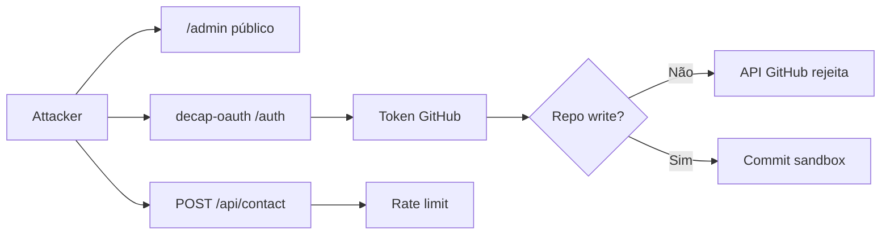
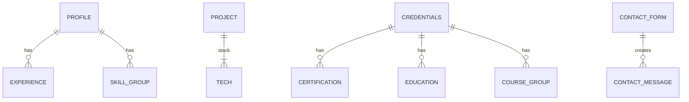
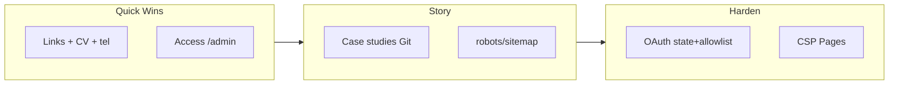

# Auditoria de Production Readiness — kleilson-portfolio

| Campo | Valor |
| --- | --- |
| **Data** | 2026-07-13 |
| **Escopo** | Código em working tree + ADRs + deploy Cloudflare Pages |
| **Baseline release** | `v0.4.0` (+ trabalho em `[Unreleased]`) |
| **Site** | https://kleilson-portfolio.pages.dev |
| **Método** | Evidência no repositório + HTTP/API GitHub autenticado; sem alterações de código neste artefato |
| **Autores da auditoria** | Análise assistida por agente; fatos ancorados em ADR-0001…0012 e código |

> **Como ler (TDAH):** cada seção começa com um **veredito em 1 linha**. Tabelas = ação. Mermaid = fluxo. Prioridade: conserte **P0** antes de go-live público para recrutadores.

---

## 1. Resumo Executivo

O portfólio já é **enterprise-ready no eixo de engenharia** (monorepo, CI, ADRs, Content-as-Code, Decap Git-backed, API de contato, observabilidade opt-in). Não é um scaffold amador: transmite disciplina de Delivery e AppSec.

Porém **ainda não está production-ready para persuasão de recrutador** por falhas de credibilidade e polish:

| Severidade | Achado |
| --- | --- |
| **P0 / Bloqueador** | Dois projetos **em destaque** apontam para GitHub **404** (`purchase-ecosystem`, `copilot-java21-springboot`) — API autenticada confirma *Not Found* |
| **P0** | Sem download de CV; narrativa de senioridade depende de claims sem case studies profundos |
| **P1** | `/admin` público sem Cloudflare Access (#121); OAuth proxy sem allowlist/state |
| **P1** | SEO SPA: meta client-side; sem `robots.txt` / `sitemap.xml` |
| **P1** | `tel:` malformado; verificação de cert aponta para página genérica do produto |
| **P2** | Sem rotas de case study; sem headers CSP em Pages; sem skip-link a11y |

### Veredito go-live

| Critério | Status |
| --- | --- |
| Deploy técnico estável | ✅ Pronto |
| Conteúdo verificável e links corretos | ❌ **Não** (P0 links) |
| Admin editorial compreensível e endurecido | ⚠️ Parcial (funciona; UX/segurança incompletas) |
| Paridade com melhores portfólios sênior | ⚠️ Bom base; falta storytelling + case studies |

**Recomendação:** publicar para networking só após **corrigir URLs 404 + CV PDF + hardening mínimo do `/admin`**. Evolução DB-backed de narrativa **conflita com ADR-0007/0012** — não é o próximo passo ótimo; endurecer Decap + case studies no Git é o caminho de maior ROI.

---

## 2. Visão Geral da Arquitetura Atual

```text
Visitante / Recrutador
        │
        ▼
┌───────────────────────────────┐
│ Cloudflare Pages (SPA web)    │
│ content/*.json no bundle      │
│ /admin = Decap estático       │
└───────────┬───────────────────┘
            │ POST /api/contact
            ▼
┌───────────────────────────────┐
│ Workers Free (worker-api)     │
└───────────┬───────────────────┘
            ▼
┌───────────────────────────────┐
│ Supabase Postgres             │
│ APENAS contact_messages       │
└───────────────────────────────┘

Editor
  → /admin (Decap)
  → decap-oauth Worker
  → GitHub OAuth + API
  → commit branch sandbox
  → PR → main → Pages
```

```mermaid
flowchart TB
  U[Visitante] --> P[CF Pages SPA]
  P --> JSON[content/*.json]
  P --> C[POST /api/contact]
  C --> W[worker-api]
  W --> DB[(contact_messages)]
  E[Editor] --> A[/admin Decap]
  A --> O[decap-oauth]
  O --> GH[GitHub sandbox]
  GH --> PR[PR + CI]
  PR --> P
```

| Pacote | Papel |
| --- | --- |
| `apps/web` | React 19 + Vite 8 + React Router 7 + Decap `/admin` |
| `apps/api` | Fastify local (helmet, CORS, rate-limit, Drizzle) |
| `apps/worker-api` | API produção Workers Free |
| `apps/decap-oauth` | Proxy OAuth GitHub (Decap) |
| `packages/shared` | Contrato de contato |

**Rotas públicas SPA:** `/` · `/sobre` · `/projetos` · `/contatos` · `*` (404).  
**Não há** `/projetos/:id`, auth React, nem admin JWT.

Fontes canônicas: [system-guide.md](../architecture/system-guide.md), [ADR-0007](../adr/0007-content-as-code.md), [ADR-0012](../adr/0012-decap-cms-git-backed.md).

---

## 3. Pontos Fortes

| Área | Evidência | Por que importa |
| --- | --- | --- |
| Governança Git | ADR-0002, `feature → sandbox → main`, SemVer | Sinal de senioridade operacional |
| Content-as-Code | JSON + Zod + Decap | Auditabilidade; evita drift “só no banco” |
| Segurança de contato | Validação server-side, rate limit, sem `GET` público de mensagens | OWASP: superfície mínima |
| Visual ADR-0004 | Dark-first, Sora + IBM Plex Sans, teal | Evita look “AI default” |
| Qualidade | typecheck, oxlint, Vitest, Playwright, Lighthouse CI, CodeQL | Barra enterprise |
| Observabilidade | Sentry opt-in, Umami, `/health`, `x-request-id` | ADR-0009/0010 |
| Documentação | ADRs + guides + `AGENTS.md` | Onboarding e agentes alinhados |
| Honestidade CV | Educação “trancado”; cursos Udemy distintos de cert vendor | Credibilidade |

---

## 4. Pontos Críticos

1. **Links GitHub 404 nos destaques** — credibilidade destruída em &lt;10s  
2. **Expectativa vs realidade do “admin”** — parece incompleto porque há *duas* superfícies (Decap + Supabase Dashboard), sem inbox no site  
3. **Projetos = cards de repo**, não case studies (faltam desafio/solução/arquitetura/métricas/demo)  
4. **Sem CV downloadável** no site (README cita CV ATS ausente do repo público)  
5. **Hardening `/admin` incompleto** (#121 Access aberto)  
6. **SEO crawler-bound** em SPA 100% client meta  

---

## 5. Gaps Identificados

| Gap | Classe | Impacto no recrutador |
| --- | --- | --- |
| Case study pages | Conteúdo/UX | Não prova profundidade sênior |
| CV PDF | Conversão | Fricção alta no ATS manual |
| Inbox de contatos no app | Ops | OK via Dashboard; confunde “admin incompleto” |
| Allowlist OAuth / Access | Segurança | Superfície editorial aberta |
| robots.txt / sitemap | SEO | Indexação subótima |
| CSP / `_headers` Pages | Segurança | Helmet só no Fastify local |
| Route code-splitting | Perf | Bundle carrega todas as páginas |
| Skip-link + aria form errors | A11y | WCAG 2.2 AA incompleto |
| i18n en | Alcance | Limitado a recrutadores BR/PT |
| Testimonials / recomendações | Trust | Ausente (opcional; só com evidência) |
| Live demos | Projetos | Só GitHub |

---

## 6. Matriz de Prioridades

Legenda: **P**rioridade · **E**sforço · **R**isco de implementação · **B**enefício

| ID | Item | P | E | R | B | Justificativa |
| --- | --- | --- | --- | --- | --- | --- |
| A1 | Corrigir/remover URLs 404 dos projetos featured | Alta | Baixo | Baixo | Crítico | Links quebrados = desconfiança imediata ([Google Search quality / broken links](https://developers.google.com/search/docs/essentials)) |
| A2 | Publicar CV PDF + CTA na Home/Sobre | Alta | Baixo | Baixo | Alto | Conversão recrutador 30s |
| A3 | Cloudflare Access em `/admin` (#121) | Alta | Médio | Baixo | Alto | Defense in depth ([CF Access](https://developers.cloudflare.com/cloudflare-one/policies/access/)) |
| A4 | OAuth `state` + allowlist username no Worker | Alta | Médio | Médio | Alto | OWASP AuthN ([Cheat Sheet](https://cheatsheetseries.owasp.org/cheatsheets/Authentication_Cheat_Sheet.html)) |
| A5 | Fix `tel:` + credential verification URL | Alta | Baixo | Baixo | Médio | UX mobile + prova de cert |
| B1 | Case studies para 2–3 projetos (`/projetos/:slug`) | Alta | Alto | Médio | Alto | Padrão de portfolios 2026 |
| B2 | `robots.txt` + `sitemap.xml` + OG completo | Média | Baixo | Baixo | Médio | [Google Search Central](https://developers.google.com/search/docs/crawling-indexing/sitemaps/build-sitemap) |
| B3 | CSP/`_headers` em Pages | Média | Médio | Médio | Alto | OWASP Secure Headers |
| B4 | Lazy routes (`React.lazy`) | Média | Baixo | Baixo | Médio | [web.dev code-splitting](https://web.dev/articles/code-splitting-suspense) |
| B5 | Skip-link + `aria-invalid` / live regions | Média | Baixo | Baixo | Médio | WCAG 2.2 |
| C1 | Inbox ops (read-only autenticado) **ou** docs UX clarificando Dashboard | Média | Alto / Baixo | Alto / Baixo | Médio | Clareza admin; ADR-0006 contraria API `GET` pública |
| C2 | Theme-color teal (remover indigo) | Baixa | Baixo | Baixo | Baixo | Consistência ADR-0004 |
| C3 | Prerender/SSR seletivo | Baixa | Alto | Alto | Médio | ADR-0001 — só se SEO orgânico for KPI |
| C4 | Migrar narrativa para Postgres CMS | **Não priorizar** | Alto | **Crítico** | Questionável | Conflita ADR-0007/0006; overengineering |

---

## 7. Auditoria Funcional

### Navegação e páginas

| Rota | Função | Estado |
| --- | --- | --- |
| `/` | Posicionamento + highlights + skills | Completa |
| `/sobre` | Experiência + soft skills + credenciais | Completa |
| `/projetos` | Lista featured + compacta | Completa UI; **links P0 quebrados** |
| `/contatos` | Canais + formulário | Completa |
| `/admin` | Decap shell | Funcional; gate incompleto |
| `/projetos/:id` | Case study | **Ausente** |

### Links quebrados / suspeitos (auditoria HTTP 2026-07-13)

| URL | Resultado | Severidade |
| --- | --- | --- |
| `https://github.com/KleilsonSantos/purchase-ecosystem` | **404** (API autenticada `Not Found`) | **P0** — featured primary |
| `https://github.com/KleilsonSantos/copilot-java21-springboot` | **404** (API autenticada `Not Found`) | **P0** — featured |
| `https://github.com/KleilsonSantos/banking` (+ 6 outros) | **200** | OK |
| `tel:+557599161-0301` | Malformado (hífen no meio dos dígitos) | P1 |
| AI-900 `verificationUrl` | Página de produto Microsoft Learn, não verificador pessoal | P1 |
| Demo/live URLs | Inexistentes no schema | Gap de produto |
| `#` / `javascript:void` vazios | Não encontrados | OK |

### Formulário de contato

Fluxo: `Contatos.tsx` → sanitize → `POST` → Worker/Fastify → `contact_messages`.  
Gaps: `messageMaxLength` JSON **2000** vs API **4000**; notificações (#122) ausentes; sem inbox in-app (por decisão ADR-0006).

### Botões / CTAs

Home: “Ver projetos” / “Entrar em contato” — funcionam.  
Projetos: “Ver no GitHub” — **dois quebrados**.  
Sem CTA “Baixar CV”.

---

## 8. Auditoria de UX/UI

### O projeto transmite nível sênior?

**Parcialmente sim na engenharia do site; parcialmente não na narrativa de produto.**

| Critério (ADR-0004 / NN/g) | Avaliação |
| --- | --- |
| Hierarquia / hero enxuto | Bom (nome + headline + CTAs) |
| Tipografia própria | Bom (Sora / IBM Plex) |
| Dark-first + tokens | Bom |
| Densidade de informação na Home | Aceitável; highlights em cards abaixo do fold |
| Storytelling de projetos | Fraco (tagline ≠ case study) |
| Motion | Adequado (fade-up; `prefers-reduced-motion`) |
| Empty/loading | Só no formulário |
| Consistência brand | Quase — `theme-color` ainda indigo `#4f46e5` |

### Melhorias UX (fundamentadas)

| Melhoria | Prioridade | Esforço | Base |
| --- | --- | --- | --- |
| Case studies com arco problema→resultado | Alta | Alto | NN/g + prática de portfolios 2026 |
| CTA CV no hero secundário | Alta | Baixo | Conversão |
| Timeline visual da carreira (opcional) | Média | Médio | Escaneabilidade; ADR-0004 excluiu V3 timeline — reavaliar com ADR |
| Reduzir overclaim visual (menos bullets “métrica”) se não houver evidência linkada | Alta | Baixo | AGENTS.md conteúdo verificável |
| Microcopy do admin (“Mensagens: use Supabase Dashboard”) | Média | Baixo | Clareza operacional |

---

## 9. Auditoria Técnica

| Dimensão | Achado |
| --- | --- |
| Arquitetura | Limpa; fronteiras claras Pages / Worker / Supabase / Decap |
| Componentização | Adequada; páginas ainda monolíticas (ok no tamanho atual) |
| Clean Code | Tipos TS; Zod conteúdo; shared contact — bom |
| SOLID/DDD | Suficiente para portfólio; DDD completo **não** se aplica |
| Testes | Unitários pontuais + E2E smoke; sem coverage gate; sem testes Worker |
| Dependências | Stack moderna (React 19, Vite 8); Decap via CDN unpkg (SRI ausente) |
| i18n | Só `pt-BR` |
| Escalabilidade módulos | Monorepo turborepo pronto; novos apps ok |

Riscos técnicos menores: Decap CDN supply-chain; drift `config.yml` ↔ Zod; commits Decap diretos em `sandbox` (bypass `feature/*` — documentado e aceito para autor único).

---

## 10. Auditoria de Segurança

### Mapa de ameaças (resumo)



### Respostas objetivas (admin)

| Pergunta | Resposta |
| --- | --- |
| Quem pode **abrir** `/admin`? | **Qualquer pessoa** (estático público) |
| Quem completa OAuth no Worker? | **Qualquer conta GitHub** (sem allowlist) |
| Quem **publica** conteúdo? | Só quem tem **write** no repo `KleilsonSantos/kleilson-portfolio` (ACL GitHub) |
| Qualquer GitHub user edita o site? | **Não** (publish), **Sim** (pode autenticar OAuth e receber token com scopes `repo,user`) |
| Estratégia AuthZ | GitHub repo ACL (+ futuro CF Access) — **sem RBAC in-app** |
| JWT/localStorage app? | **Não** (proibido ADR-0007) |
| Fluxo seguro? | **Parcialmente** — AuthZ efetiva no GitHub; AuthN proxy frágil |
| Risco exposição? | Config Decap + superfície UI; token XSS-sensível no browser Decap |

### Controles OWASP (ASVS / Top 10 mapeados)

| Controle | Status | Nota |
| --- | --- | --- |
| A01 Broken Access Control | Parcial | Sem Access; AuthZ no GitHub ok |
| A02 Cryptographic Failures | OK | HTTPS CF; secrets Wrangler |
| A03 Injection | Bom | Schema contact; React text |
| A04 Insecure Design | Atenção | Admin dual-model confuso; narrative-in-DB rejeitado (bom) |
| A05 Security Misconfiguration | Atenção | Sem CSP Pages; CORS Worker permissivo se env vazia |
| A07 Auth Failures | Atenção | Sem `state` OAuth; scopes amplos |
| Rate limiting | Parcial | Fastify ok; Worker in-memory por isolate |
| XSS | Bom no SPA; risco residual no `/admin` CDN |

### Arquiteturas de admin propostas (decisão)

| Opção | Prós | Contras | Recomendação |
| --- | --- | --- | --- |
| **A. Endurecer Decap (atual)** + CF Access + allowlist OAuth + SRI | Alinha ADR-0007/0012; PR/CI; baixo custo Free | Não é “CMS DB” | **Escolher agora** |
| **B. GitHub OAuth AuthN + allowlist + roles em app + API CRUD + JWT** | UX unificada | Reintroduz superfície admin; JWT browser = risco XSS; conflita ADR | Rejeitar sem novo ADR |
| **C. Supabase Auth + tabelas de conteúdo + RLS** | UI rica; realtime | Segunda SoT; RLS errado = vazamento; conflita ADR-0006/0007 | Rejeitar para narrativa |
| **D. Decap + `editorial_workflow` (PR por entry)** | Review automático | Overhead p/ autor único | Opcional futuro se multi-editor |

**RBAC mínimo recomendado (sem abandonar Git):**

```text
AuthN: GitHub OAuth (+ Cloudflare Access email/GitHub allowlist)
AuthZ publish: GitHub collaborator write
AuthZ edge: CF Access policy → só emails/ids do owner
Claims: não necessários se AuthZ = GitHub ACL
Session: token Decap no browser; reduzir XSS via CSP strict em /admin
```

---

## 11. Auditoria de Performance

| Item | Status |
| --- | --- |
| CDN Pages | ✅ |
| Imagens WebP + dimensões | ✅ |
| Fonts Google `@import` | ⚠️ Render-blocking potencial |
| Lazy routes | ❌ Eager imports em `App.tsx` |
| manualChunks | ❌ |
| Lighthouse CI | ✅ só `/`, thresholds a11y rigorosos |
| Prefetch/preload estratégico | Parcial |

**Core Web Vitals:** sem medição RUM em produção documentada neste audit; LH CI é proxy.  
Impacto esperado de lazy routes: menor TTI em deep links — [web.dev](https://web.dev/articles/code-splitting-suspense).

---

## 12. Auditoria de SEO

| Item | Status |
| --- | --- |
| Title/description/canonical (cliente) | ✅ `useDocumentMeta` |
| OG / Twitter | Parcial (Home/Sobre com image; Projetos/Contatos incompletos) |
| JSON-LD Person | ✅ Home/Sobre |
| robots.txt | ❌ |
| sitemap.xml | ❌ |
| Meta estático no HTML para crawlers sem JS | Fraco (SPA) |
| PWA manifest | ❌ (opcional) |
| theme-color | Indigo — desalinhado ao brand |

Referências: [Google Search Central — JS SEO](https://developers.google.com/search/docs/crawling-indexing/javascript/javascript-seo-basics), [schema.org Person](https://schema.org/Person).

---

## 13. Auditoria de Acessibilidade (WCAG 2.2 AA)

| Critério | Status |
| --- | --- |
| Landmarks / labels nav | ✅ |
| Focus-visible | ✅ |
| Reduced motion | ✅ |
| Labels de formulário | ✅ |
| Skip to main | ❌ |
| `aria-invalid` / `aria-describedby` erros | ❌ |
| Status form `role="alert"` / `aria-live` | ❌ |
| Contraste tokens dark | Intencional; LH a11y gate ≥0.9 |

---

## 14. Auditoria da Área Administrativa

### Duas superfícies (causa da “incompletude”)

| Superfície | O que gerencia | Como |
| --- | --- | --- |
| Decap `/admin` | Profile, projetos, credenciais, canais/contato UI | Commit Git `sandbox` |
| Supabase Dashboard | Mensagens recebidas | Table Editor |

Não existe painel único “gerenciar tudo + inbox + SEO + uploads avançados”.

### Decap cobre vs desejo “admin total”

| Desejo | Hoje |
| --- | --- |
| Projetos / experiência / certs / cursos / skills / sociais / canais | ✅ Decap collections |
| Artigos / blog / FAQ / depoimentos / timeline rica | ❌ modelo inexistente |
| Mensagens | ⚠️ Dashboard só |
| SEO técnico (sitemap, robots) | ❌ código/deploy |
| Imagens | ⚠️ paths string; media_folder pouco usado |
| Currículo PDF | ❌ |
| Configurações site | ⚠️ via JSON profile |

### Segurança admin — checklist

- [ ] Cloudflare Access (#121)
- [ ] Allowlist GitHub login no Worker
- [ ] OAuth `state` / CSRF
- [ ] Reduzir scope se possível / documentar risco `repo`
- [ ] SRI no script Decap CDN
- [ ] Microcopy “não é portal de mensagens”
- [ ] (Opcional) `editorial_workflow`

Detalhe operacional: [admin-operations.md](../guides/admin-operations.md).

---

## 15. Auditoria de Persistência de Dados

### Onde os dados vivem hoje

| Dados | Persistência |
| --- | --- |
| Profile, skills, experience, projects, credentials, contact channels | `apps/web/content/*.json` (Git) |
| Mensagens de formulário | Postgres `contact_messages` |
| Tema UI | `localStorage` chave tema (não auth) |

### O que deve permanecer em código/Git

| Permanecer | Motivo |
| --- | --- |
| Narrativa profissional (CV/projetos) | ADR-0007; review; evidência; OpenGitOps |
| Decap config + schemas Zod | Contrato de conteúdo |
| Copy UI estrutural | Versionamento com design |

### O que deve ir / permanecer no banco

| Banco | Motivo |
| --- | --- |
| `contact_messages` | Operacional, PII, alto churn |
| Futuro: analytics events, rate-limit durable, audit logs ops | Operacional |
| **Não:** profile/projects no Postgres | Segunda SoT + risco AuthZ ([Supabase RLS](https://supabase.com/docs/guides/database/postgres/row-level-security)) |

### Modelo conceitual atual + evolução Git

```text
┌────────────┐     contains      ┌──────────────┐
│  Profile   │──────────────────▶│ Experience[] │
│            │──────────────────▶│ SkillGroup[] │
└─────┬──────┘                   └──────────────┘
      │
      │  (site persona)
      ▼
┌────────────┐                   ┌──────────────┐
│  Project[] │── url ───────────▶│ GitHub Repo  │
└────────────┘                   └──────────────┘
┌────────────┐
│Credentials │── certs / education / courses
└────────────┘
┌────────────┐     writes        ┌──────────────────┐
│ Contact UI │                   │ contact_messages │
│  (JSON)    │──── POST form ───▶│ id, name, email… │
└────────────┘                   └──────────────────┘
```



### Se no futuro houver ADR superando 0007 (não recomendado agora)

Entidades candidatas: `projects`, `project_media`, `experiences`, `skills`, `certifications`, `articles`, `testimonials`, `site_settings`, `admin_users`, `roles`, `audit_log` — com soft delete, `updated_at`, versionamento ou outbox para publicar snapshot estático.  
**Custo:** AuthZ + RLS + migrações + sync CV + perda do “PR = review de fatos”.  
**Só faça** se multi-editor não-técnico ou CMS real forem requisitos de negócio explícitos.

---

## 16. Benchmark dos Melhores Portfólios

Fontes: [developer-portfolios](https://github.com/emmabostian/developer-portfolios), tendências 2026 (case study arc), referências já no ADR-0004 (Chiang, Lee Robinson, Comeau, Anthony Fu, Kent C. Dodds). **Não copiar layouts.**

| Padrão dos tops | Este projeto | Ação |
| --- | --- | --- |
| Hero claro “quem + o quê” | ✅ | Manter |
| 3–6 projetos selecionados com profundidade | ⚠️ 9 cards rasos; 2 links mortos | Curadoria + case studies |
| Case study: problema → abordagem → resultado | ❌ | Prioridade Alta |
| Prova social (recomendação) | ❌ | Só com evidência real |
| Blog/artigos técnicos | ❌ | Baixa p/ go-live; alta p/ SEO longo prazo |
| Performance obsessiva | Parcial | Lazy routes + fonts |
| Personalidade sem gimmick | ✅ | Manter ADR-0004 |
| CTAs conversão (CV / calendário) | Parcial | CV |
| English toggle | ❌ | Médio prazo se meta internacional |

Ideias **extrair**:

- Featured = max 3, cada um com página própria  
- Lead with outcome no primeiro parágrafo do case study  
- Screenshots reais / diagrama ASCII ou Mermaid de arquitetura  
- “Selected work” acima da dobra na Home (além de highlights)

---

## 17. Recomendações Arquiteturais

### Princípio guia

> **Trate o portfólio como produto de persuasão versionado no Git; trate o banco como runtime operacional.**

### Caminho alvo (12 semanas)



1. **Não migrar narrativa para DB** sem ADR explícito superseding 0007.  
2. **Estender JSON schema** com campos de case study (`challenge`, `solution`, `architecture`, `metrics`, `demoUrl`, `media[]`) — Decap + Zod juntos.  
3. **Rota `/projetos/:slug`** com lazy load.  
4. **Admin:** Decap endurecido + docs claros + Access; inbox permanece Dashboard **ou** app read-only atrás de CF Access (issue nova + ADR se API `GET`).  
5. **SEO estático mínimo** sem obrigar Next.js (sitemap estático + meta bootstrap no `index.html` ou prerender seletivo).

### Matriz: Content-as-Code vs CMS DB

| Critério | Git + Decap | CMS DB |
| --- | --- | --- |
| Review de fatos | Excelente | Fraco sem workflow extra |
| Superfície ataque | Menor (com Access) | Maior |
| Multi-editor não-dev | Médio | Alto |
| Free tier CF | Adequado | Custo/complexidade sobe |
| Alinhamento ADRs | ✅ | ❌ hoje |

---

## 18. Roadmap de Implementação

### Quick Wins (≤ 1 semana)

- [ ] A1 — Corrigir/remover `purchase-ecosystem` e `copilot-java21-springboot` (publicar repos ou atualizar URLs)
- [ ] A2 — CV PDF em `public/` + CTA
- [ ] A5 — `tel:+5575991610301` + URL de verificação real ou remover campo
- [ ] C2 — `theme-color` teal
- [ ] Microcopy admin (mensagens ≠ Decap)
- [ ] Gate CI: smoke que falhe se `project.url` retornar 404

### Curto prazo (1–3 semanas)

- [ ] A3 — Cloudflare Access `#121`
- [ ] A4 — OAuth `state` + allowlist no `decap-oauth`
- [ ] B2 — robots.txt + sitemap.xml + OG em todas as rotas
- [ ] B4 — `React.lazy` nas pages
- [ ] B5 — skip-link + aria form

### Médio prazo (1–2 meses)

- [ ] B1 — schema + UI case studies (2–3 projetos)
- [ ] B3 — `_headers` CSP/HSTS em Pages
- [ ] SRI Decap / pin versão
- [ ] Notificação contato `#122`
- [ ] Página ou seção “Como edito o site” para o próprio operador (reduz dúvida)

### Longo prazo (trimestre+)

- [ ] EN locale (conteúdo duplicado versionado)
- [ ] Blog MDX Git-backed (se KPI SEO)
- [ ] Prerender/SSR se Search Console exigir
- [ ] Grafana RUM só com tráfego real (ROADMAP)
- [ ] Reavaliar CMS DB **somente** com novo ADR e requisitos de multi-editor

---

## 19. Checklist de Produção (Go-Live)

### Bloqueadores

- [ ] Nenhum link featured retorna 404 (GH API)
- [ ] CV PDF acessível e testado em mobile
- [ ] Smoke contato prod grava no Supabase
- [ ] Worker API health verde
- [ ] Decap login funciona **e** Access (ou allowlist) ativo
- [ ] Secrets nunca em `VITE_*`
- [ ] `pnpm typecheck && pnpm lint && pnpm test && pnpm build` verdes
- [ ] Playwright + Lighthouse CI verdes no PR

### Qualidade / confiança

- [ ] Highlights linkam ou espelham evidência CV/LinkedIn/GitHub
- [ ] Certificação com prova verificável
- [ ] 404 page com meta noindex
- [ ] Política SECURITY.md e Dependabot ok
- [ ] CHANGELOG `[Unreleased]` alinhado à tag

### Recrutador 30s

- [ ] Em 5s: nome, papel, stackedifferencial claros
- [ ] Em 15s: 1 projeto clicável **vivo**
- [ ] Em 30s: caminho óbvio para contato **e** CV

---

## 20. Experiência do Recrutador (30 segundos)

| Tempo | O que vê | Risco | Melhoria |
| --- | --- | --- | --- |
| 0–5s | Nome, headline financeiro/AppSec/AI, foto, CTAs | Headline forte ✅ | Manter |
| 5–15s | Highlights com métricas | Pode parecer marketing se não clicável | Ligar evidências |
| 15–25s | Projetos / GitHub | **404 nos destaques = credibility kill** | A1 |
| 25–30s | Contato | Bom (form + WhatsApp) | + CV |

**O que aumenta chance de hire:** prova de entrega (repos vivos + case studies), CV, clareza de stack bancária/AppSec, ausência de links mortos.  
**O que reduz:** 404, admin confuso se explorarem `/admin`, claims sem deep dive.

---

## 21. Referências Oficiais Utilizadas

| Tema | Referência |
| --- | --- |
| GitOps conteúdo | [OpenGitOps Principles](https://opengitops.dev/) |
| Decap | [Decap CMS](https://decapcms.org/docs/intro/), [GitHub OAuth proxy](https://decapcms.org/docs/backends-overview/#using-github-with-an-oauth-proxy) |
| Auth | [OWASP Authentication Cheat Sheet](https://cheatsheetseries.owasp.org/cheatsheets/Authentication_Cheat_Sheet.html) |
| ASVS / Top 10 | [OWASP ASVS](https://owasp.org/www-project-application-security-verification-standard/), [OWASP Top 10](https://owasp.org/Top10/) |
| RLS | [Supabase Row Level Security](https://supabase.com/docs/guides/database/postgres/row-level-security) |
| Access | [Cloudflare Access](https://developers.cloudflare.com/cloudflare-one/policies/access/) |
| SEO | [Google Search Central](https://developers.google.com/search/docs), [JavaScript SEO](https://developers.google.com/search/docs/crawling-indexing/javascript/javascript-seo-basics) |
| Schema | [schema.org/Person](https://schema.org/Person) |
| A11y | [WCAG 2.2](https://www.w3.org/TR/WCAG22/) |
| Perf | [web.dev code splitting](https://web.dev/articles/code-splitting-suspense), [Core Web Vitals](https://web.dev/articles/vitals) |
| React | [React docs](https://react.dev/) |
| Headers | [OWASP Secure Headers Project](https://owasp.org/www-project-secure-headers/) |
| Docs eng | [Google eng-practices — documentation](https://google.github.io/eng-practices/review/reviewer/looking-for.html) |
| Benchmarks | [emmabostian/developer-portfolios](https://github.com/emmabostian/developer-portfolios), práticas de case study 2026 |
| Interno | ADR-0001…0012, `AGENTS.md`, `docs/architecture/system-guide.md`, `docs/guides/admin-operations.md` |

---

## Apêndice A — Inventário de conteúdo JSON

| Arquivo | Entidades |
| --- | --- |
| `apps/web/content/profile.json` | profile, summary, highlights, softSkills, skillGroups, experience |
| `apps/web/content/projects.json` | projects[] |
| `apps/web/content/credentials.json` | certifications, education, courseGroups |
| `apps/web/content/contact.json` | categories, channels, social, messageMaxLength |

## Apêndice B — Diagrama ASCII “o que o admin realmente é”

```text
┌──────────────── ADMIN EXPECTATIVA ────────────────┐
│  Um login → editar tudo → ver mensagens → SEO     │
└───────────────────────────────────────────────────┘
                         │
                         ▼ realidade
        ┌────────────────┴────────────────┐
        ▼                                 ▼
┌───────────────┐                 ┌───────────────┐
│ Decap /admin  │                 │ Supabase UI   │
│ (GitHub OAuth)│                 │ (org members) │
│ conteúdo JSON │                 │ mensagens     │
└───────────────┘                 └───────────────┘
```

## Apêndice C — Critérios de rastreabilidade deste documento

Cada recomendação amarra-se a: evidência de código/ADR **ou** padrão público (OWASP/WCAG/Google/CF/Decap). Itens subjetivos de “beleza Awwwards” foram deliberadamente subordinados a usabilidade e credibilidade (ADR-0004 rejeitou motion Awwwards pesado).

---

*Fim da auditoria. Próximo passo sugerido: issue P0 “fix broken featured project GitHub URLs” + kickoff `feature/fix-featured-project-links` a partir de `sandbox`.*
