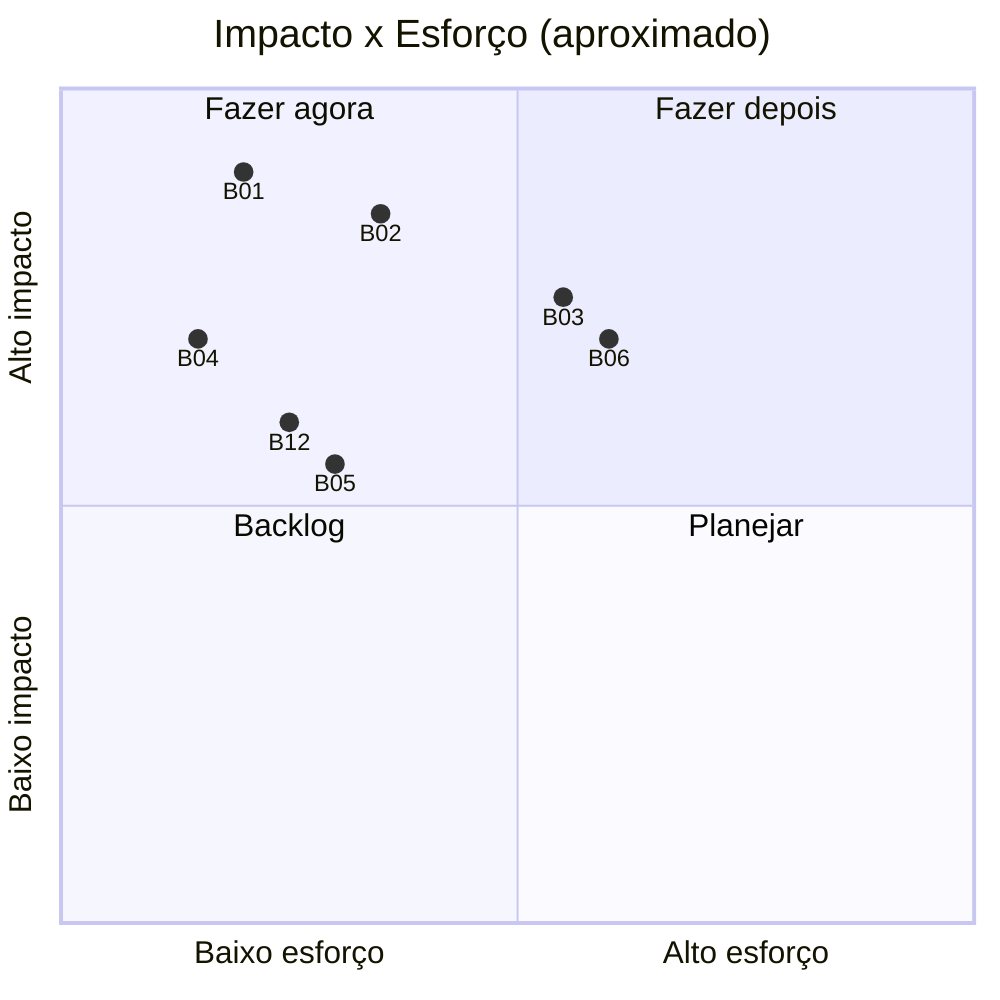

# Auditoria de Usabilidade, Funcionalidade e Qualidade — kleilson-portfolio

| Campo | Valor |
| --- | --- |
| **Data** | 2026-07-13 |
| **Commit `main`** | `1688819` |
| **Produção** | https://kleilson-portfolio.pages.dev |
| **API** | https://kleilson-portfolio-api.kleilsonsantos.workers.dev |
| **Natureza** | Validação **runtime + código** (não só revisão documental) |
| **Complementa** | [production-readiness-audit-2026-07.md](./production-readiness-audit-2026-07.md) |

> **Leitura rápida (TDAH):** §1 = veredito. §20 = bugs. §22 = o que corrigir primeiro. Itens sem ferramenta marcada = **limitação** (não inventado).

---

## 1. Resumo Executivo

O portfólio **funciona** em produção para o fluxo visitante → contato e para a navegação SPA. Gates locais (`typecheck` / `lint` / Vitest / Playwright / build) passaram. Links GitHub dos projetos estão **200**. Persistência de contato e `/health` com Postgres estão **OK**.

Ainda há débitos que afetam **credibilidade SEO**, **defesa admin**, **a11y de formulário** e **hardening** — nenhum deles impede “site no ar”, mas vários são P1 antes de campanha séria com recrutadores internacionais/ATS.

| Dimensão | Nota (fato) |
| --- | --- |
| Funcional (rotas + contato) | ✅ Passa smoke prod + E2E |
| Usabilidade recrutador 30s | ⚠️ Clara quem/o quê; falha tel:; sem CV; projetos rasos |
| Admin | ⚠️ Decap público (Access **não** ativo); OAuth GitHub ACL publish |
| SEO crawlers sem JS | ❌ `/robots.txt` e `/sitemap.xml` devolvem **SPA HTML** |
| Segurança API | ✅ Validação + CORS restrito; rate-limit **fraco** (in-memory) |
| A11y form | ⚠️ Labels OK; sem `aria-invalid` / live regions |
| Performance (LHCI desktop estático, 2026-07-09) | Perf **0.71**; a11y/SEO/BP **1.0** (ambiente estático `/`) |

**Veredito go-live técnico:** **condicional** — estável para networking; completar P0/P1 de SEO estático + Access + `tel:` antes de tratar como vitrine “enterprise impecável”.

---

## 2. Escopo da Auditoria

| Incluído | Evidência |
| --- | --- |
| Rotas públicas SPA | HTTP prod + Playwright local |
| `/admin` Decap shell | HTTP prod + E2E `admin.spec.ts` |
| Contato POST + health | `curl` prod + Supabase MCP |
| Conteúdo projetos/contato | JSON `main` + HEAD/GET GitHub |
| Qualidade CI-local | pnpm typecheck/lint/test/build |
| Headers HTTP Pages/API | `curl -I` |
| SEO arquivo estático | GET `/robots.txt` `/sitemap.xml` |
| DB `contact_messages` | Supabase MCP `list_tables` / SQL / advisors |
| Bundle Vite | build output |

| Fora / limitado | Motivo |
| --- | --- |
| Cross-browser Safari/Firefox manual | Sem Browser MCP; Playwright só Chromium neste run |
| Screen reader real (VoiceOver) | Não executado |
| Sentry/Umami dashboards | Opt-in; sem DSN no teste |
| Upload/mídia Decap CRUD completo | Requer OAuth humano |
| Cloudflare Access gate | Runbook existe; **UI Decap ainda pública** em 2026-07-13 |
| RUM Core Web Vitals campo | Sem CrUX/RUM neste ambiente |

---

## 3. Metodologia de Testes

```text
1. Gates estáticos     → typecheck · lint · Vitest · build
2. E2E local           → Playwright Chromium (7 specs)
3. Smoke produção      → HTTP rotas · headers · API · links GitHub
4. Dados               → Supabase MCP (tabelas, count, advisors)
5. Artefatos LHCI      → .lighthouseci (desktop static, 2026-07-09)
6. Code inspection     → Contatos aria · useDocumentMeta · worker rate-limit
```

Separação explícita em achados: **Fato observado** | **Limitação** | **Recomendação**.

---

## 4. Recursos Utilizados

| Recurso | Uso efetivo |
| --- | --- |
| Shell (`curl`, `pnpm`, `gh`, Python) | Smoke prod, gates, links |
| Playwright (após `playwright install chromium`) | 7/7 passed local |
| Supabase MCP (`list_tables`, `execute_sql`, `get_advisors`) | DB contato + RLS advisory |
| GitHub CLI | Conteúdo `main`, deploys recentes |
| Lighthouse CI artifacts no repo | Scores históricos |
| Leitura de código/ADRs/guides | Causa raiz / decisão arquitetural |
| Explore agents (contexto prévio) | Admin/auth/SEO gaps já conhecidos |

---

## 5. Recursos Não Disponíveis e Limitações

| Recurso | Status | Impacto na avaliação |
| --- | --- | --- |
| Browser MCP / DevTools remoto | Ausente | Sem inspeção DOM live em prod além de HTML fetch |
| SonarQube MCP | `serverStatus: error` | Sem quality gate Sonar |
| Snyk / Datadog / Grafana | Fora da matriz canônica / sem sessão | Sem APM enterprise |
| Vercel | Proibido ADR-0008 | N/A |
| Playwright Firefox/WebKit | Não instalados neste run | Cross-browser não coberto |
| VoiceOver / axe CLI | Não executados | A11y = código + LHCI a11y score |
| LHCI fresh run | Não reexecutado agora | Scores datados 2026-07-09 |
| Login Decap OAuth | Sem interação humana | Admin = shell + config apenas |
| Zero Trust dashboard | Sem API token | Access confirmado **ausente** via HTML público Decap |

---

## 6. Matriz de Cobertura dos Testes

| Área | Local | Produção | Automático | Manual |
| --- | --- | --- | --- | --- |
| Nav SPA | ✅ E2E | ✅ HTTP 200 | ✅ | — |
| 404 UI | ✅ E2E | ⚠️ SPA sempre 200 HTML | ✅ | — |
| Contato form | ✅ E2E mock | ✅ POST 200/400 | ✅ | — |
| Links projetos | — | ✅ 7× GitHub 200 | ✅ | — |
| Admin shell | ✅ E2E | ✅ HTML Decap | ✅ | OAuth ❌ |
| Responsividade | Código + CSS | — | Parcial E2E padding | Breakpoints visuais ❌ |
| Cross-browser | Chromium | — | Parcial | Safari/FF ❌ |
| Perf | LHCI artefato | — | Parcial | RUM ❌ |
| A11y | LHCI + code | — | Parcial | SR ❌ |
| SEO static files | — | ✅ evidência falha | ✅ | — |
| Segurança API | — | ✅ | ✅ | Pentest ❌ |
| DB | — | ✅ MCP | ✅ | Migrations git ❌ |

---

## 7. Auditoria Funcional

### Rotas (produção)

| Path | HTTP | Observação |
| --- | --- | --- |
| `/` `/sobre` `/projetos` `/contatos` | **200** | HTML SPA |
| `/admin/` | **200** | Shell Decap + CDN unpkg |
| `/rota-inexistente-xyz` | **200** | Esperado em SPA; UI 404 via React Router (E2E ok) |

### Contato API (produção)

| Caso | Resultado |
| --- | --- |
| `POST {}` | **400** `Nome inválido` + `requestId` |
| `POST` válido | **200** `success` + UUID |
| Payload com `<script>` | **200** — persistido (sanitização remove controles; HTML fica no texto) |
| `GET /health` | **200** readiness ok, `storage: postgres`, `checks.database: ok` |
| `HEAD /health` | **404** — Worker não trata HEAD como GET |

### E2E local

**7 passed** (`smoke` + `admin`) após instalar Chromium Headless Shell.

### Gaps funcionais (sem inventar features)

- Sem download CV, blog, case study routes, i18n, inbox web.
- Rate-limit Worker: **7 POST ≈1s todos 200** — limite 5/min/IP **não efetivo** sob isolates (fato neste ensaio).

---

## 8. Auditoria de Usabilidade

| Persona | Compreende em ~30s? | Fricção observada |
| --- | --- | --- |
| Recrutador RH | Sim (nome, título, CTAs) | Sem CV PDF; métricas sem deep-link |
| Tech lead | Sim (stack + featured) | Case studies rasos; só GitHub |
| Dev | Sim | Links OK agora |
| Visitante casual | Sim | `tel:` com hífen pode falhar no mobile |
| Cliente | Parcial | Contato bom; sem agenda/Calendly |

Heurísticas NN/g relevantes: **visibilidade do status** (form loading OK); **prevenção de erro** (validação OK); **consistência** (`theme-color` indigo vs teal ADR-0004).

---

## 9. Auditoria da Navegação

| Item | Resultado |
| --- | --- |
| Menu 4 rotas | ✅ E2E |
| Mobile hamburger | Limitação: não revalidado visual neste run (código + CI histórico) |
| Links GitHub projetos | ✅ todos 200 |
| `tel:+557599161-0301` | ❌ malformado ([RFC 3966](https://www.rfc-editor.org/rfc/rfc3966) — só dígitos após `+`) |
| mailto / WhatsApp / LinkedIn / GitHub sociais | Estrutura válida no JSON |
| Breadcrumbs | N/A (IA não requer) |
| Loop / órfãs | Não observados nas 4 rotas |

---

## 10. Auditoria da Área Administrativa

```text
Visitante
   │
   ▼
/admin HTML ──(ainda público)──► Decap CDN
   │
   ▼ Login GitHub
decap-oauth ──token──► GitHub ACL (write = publish)
```

| Controle | Status 2026-07-13 |
| --- | --- |
| Shell `/admin` acessível sem Access | **Sim** (HTML Decap servido) |
| `robots` noindex no admin | ✅ |
| Publish sem write no repo | Bloqueado pelo GitHub (não retestado OAuth) |
| Runbook Access | ✅ docs em `main` (#121 fechada; **gate não ativo**) |
| CRUD Decap | Limitação: OAuth humano não executado |
| Mensagens contato | Dashboard Supabase (sem UI no site) |

**Conclusão:** AuthZ de publish OK por GitHub; **AuthZ de visualização admin incompleta** até Access.

---

## 11. Auditoria de Responsividade

| Evidência | Resultado |
| --- | --- |
| E2E padding lista projetos ≥16px | ✅ |
| Tokens/fluid layout ADR-0004 | Presentes no CSS |
| Breakpoints 320–ultrawide visual | **Limitação** — não capturado com screenshots multi-device neste run |

---

## 12. Auditoria Cross-Browser

| Browser | Resultado |
| --- | --- |
| Chromium (Playwright) | ✅ 7/7 |
| Firefox / Safari / Edge | **Não executado** neste ambiente |

Expectativa técnica (não testada): View Transitions / `prefers-reduced-motion` — suporte uneven; degradam graciosamente em geral ([MDN View Transitions](https://developer.mozilla.org/en-US/docs/Web/API/View_Transition_API)).

---

## 13. Auditoria de Performance

### Build atual (`pnpm --filter @kleilson/web build`)

| Asset | Tamanho |
| --- | --- |
| JS | 267.40 kB (gzip **84.95 kB**) |
| CSS | 26.23 kB (gzip 5.31 kB) |
| Code splitting rotas | ❌ chunk único |

### LHCI artefato (desktop, `staticDistDir`, 2026-07-09)

| Categoria | Score |
| --- | --- |
| Performance | **0.71** |
| Accessibility | **1.00** |
| Best Practices | **1.00** |
| SEO | **1.00** |
| LCP / FCP | ~2.5 s (ambiente estático local histórico) |

**Limitação:** score SEO=1 no LHCI **não** implica `robots.txt`/`sitemap` corretos em produção (LHCI não os pede como HTML files reais neste setup).

Refs: [web.dev CWV](https://web.dev/articles/vitals), [code splitting](https://web.dev/articles/code-splitting-suspense).

---

## 14. Auditoria de Segurança

| Controle | Evidência | Severidade se gap |
| --- | --- | --- |
| Validação contato | 400 em payload vazio | — |
| CORS Worker | `Access-Control-Allow-Origin: https://kleilson-portfolio.pages.dev` (Origin evil ≠ ecoado no OPTIONS probe com allowlist) | — |
| Rate limit Worker | 7/7 POST 200 em &lt;2s | **Alta** (spam) |
| XSS stored | Payload HTML aceito no DB | **Média** (risco se UI futura renderizar HTML cru; React text = safe) |
| CSP / HSTS Pages | Ausentes nos headers observados | **Média** |
| `X-Content-Type-Options: nosniff` | Presente | — |
| `/admin` + Decap CDN unpkg sem SRI | Público | **Alta** (superfície + supply chain) |
| Secrets em resposta | Não observados | — |
| RLS `contact_messages` | Enabled; **sem policies** (advisor INFO) | **Info** — deny anon; só `service_role` (ADR-0006) |

Refs: [OWASP Top 10](https://owasp.org/Top10/), [ASVS](https://owasp.org/www-project-application-security-verification-standard/), [Supabase RLS](https://supabase.com/docs/guides/database/postgres/row-level-security).

---

## 15. Auditoria de SEO

| Item | Produção | Severidade |
| --- | --- | --- |
| `GET /robots.txt` | Devolve **index.html SPA** (572 B) | **Crítica** p/ crawlers de ficheiro |
| `GET /sitemap.xml` | Idem SPA HTML | **Crítica** |
| Title/author no shell | ✅ estático parcial | — |
| Meta/OG/JSON-LD | Só via JS `useDocumentMeta` | **Alta** p/ crawlers sem JS completo |
| `theme-color` | `#4f46e5` (indigo) | Baixa (brand) |
| Canonical | Client-side | Média |

Refs: [Google robots.txt](https://developers.google.com/search/docs/crawling-indexing/robots/intro), [JS SEO](https://developers.google.com/search/docs/crawling-indexing/javascript/javascript-seo-basics).

---

## 16. Auditoria de Acessibilidade (WCAG 2.2 AA)

| Critério | Status | Evidência |
| --- | --- | --- |
| Labels `htmlFor` form | ✅ | `Contatos.tsx` |
| `aria-invalid` / `aria-describedby` | ❌ | Code grep |
| Status `aria-live` / `role="alert"` | ❌ | Code grep |
| Skip link | ❌ | Code |
| Focus-visible / reduced-motion | ✅ | CSS (audit anterior + ADR-0004) |
| LHCI a11y | 1.0 | Artefato (Home estático) |

Refs: [WCAG 2.2](https://www.w3.org/TR/WCAG22/) — 3.3.1/3.3.3 erros; 2.4.1 bypass blocks.

---

## 17. Auditoria de Banco de Dados

| Item | Evidência |
| --- | --- |
| Tabela | `public.contact_messages` |
| RLS | `rls_enabled: true` |
| Policies | Nenhuma (linter INFO) — acesso via `service_role` |
| Rows (durante audit) | count dinâmico (mensagens de probe incluídas) |
| Migrations versionadas no git | **Ausentes** (conhecido system-guide) |
| Soft delete / audit columns | Só schema mínimo contato |
| Narrativa em DB | Não (ADR-0007) — correto |

---

## 18. Auditoria de APIs

| Endpoint | Método | Resultado |
| --- | --- | --- |
| `/health` | GET | 200 JSON rico + `x-request-id` |
| `/health` | HEAD | 404 |
| `/api/contact` | POST | 200/400 conforme validação |
| `/api/contact` | GET | Sem listagem pública (intencional) |
| Versionamento URL | N/A | Aceitável p/ escopo |

Consistência erro: JSON `{ message, requestId }` — bom para suporte.

---

## 19. Auditoria de Observabilidade

| Sinal | Status |
| --- | --- |
| `requestId` API | ✅ |
| Health readiness DB | ✅ |
| Sentry | Opt-in (não verificado ativo) |
| Umami | Opt-in |
| Workers Observability | Assumido CF (não lido dashboard) |
| Alertas | Não configurados neste audit |

---

## 20. Lista Consolidada de Bugs e Inconsistências

| ID | Descrição | Severidade | Prob. | Evidência | Causa | Recomendação | Prioridade | Ref |
| --- | --- | --- | --- | --- | --- | --- | --- | --- |
| B01 | `/robots.txt` e `/sitemap.xml` = SPA HTML | Crítica | Alta | curl body = doctype html | Sem ficheiros em `public/` + fallback Pages | Adicionar `robots.txt`/`sitemap.xml` estáticos | P0 | Google robots |
| B02 | `/admin` Decap público (Access off) | Alta | Alta | HTML Decap 200 | Zero Trust não ativado | Ativar Application paths `admin`+`admin/*` | P0 | CF Access |
| B03 | Rate-limit Worker não disparou (7×200) | Alta | Média | curl loop | Map in-memory por isolate | Durable Object / KV / CF Rate Limiting | P1 | OWASP API4 |
| B04 | `tel:` com hífen | Alta | Alta | `contact.json` | Formatação display no href | `tel:+5575991610301` | P0 | RFC 3966 |
| B05 | Sem skip-link / aria form errors | Média | Alta | código | Lacuna implementação | Skip + `aria-invalid` + `aria-live` | P1 | WCAG 2.2 |
| B06 | Meta SEO só client-side | Alta | Alta | index.html mínimo | SPA Vite | Prerender seletivo ou meta bootstrap | P1 | Google JS SEO |
| B07 | Sem CSP/HSTS nos headers Pages | Média | Média | curl -I | Sem `_headers` | Cloudflare `_headers` / Transform Rules | P1 | OWASP Secure Headers |
| B08 | Decap via unpkg sem SRI | Média | Média | admin HTML | CDN pin frágil | Vendor + SRI ou self-host | P2 | SRI MDN |
| B09 | `theme-color` indigo | Baixa | Alta | `useDocumentMeta` | Resíduo | Teal `#2dd4bf` | P2 | ADR-0004 |
| B10 | HEAD `/health` → 404 | Baixa | Baixa | curl -I | Handler só GET | Aceitar HEAD=GET | P3 | HTTP semantics |
| B11 | HTML stored em `contact_messages` | Média | Média | POST XSS probe 200 | Sanitize ≠ HTML escape | Escape na qualquer UI futura; opcional strip tags server | P2 | OWASP XSS |
| B12 | Sem CV download | Média | Alta | site/content | Escopo | PDF em `public/` + CTA | P1 | Conversão |
| B13 | Bundle monolítico ~85 kB gz JS | Baixa | Alta | build | Sem `React.lazy` | Lazy routes | P2 | web.dev |
| B14 | LHCI/perf só `/` desktop estático | Baixa | — | config | Escopo CI | Expandir URLs/mobile | P3 | LHCI docs |

---

## 21. Matriz de Severidade e Priorização



| Prioridade | IDs |
| --- | --- |
| P0 | B01, B02, B04 |
| P1 | B03, B05, B06, B07, B12 |
| P2 | B08, B09, B11, B13 |
| P3 | B10, B14 |

---

## 22. Plano de Correção

### Quick Wins (≤2 dias)

- [ ] B01 `public/robots.txt` + `public/sitemap.xml` (URLs reais, não SPA)
- [ ] B04 corrigir `tel:`
- [ ] B09 `theme-color` teal
- [ ] B02 ativar Cloudflare Access (runbook já em `admin-operations.md`)
- [ ] B12 CV PDF + CTA

### Curto prazo (1–2 semanas)

- [ ] B05 a11y form + skip-link
- [ ] B07 `_headers` CSP mínima + HSTS
- [ ] B03 rate-limit durable
- [ ] B13 `React.lazy` nas pages
- [ ] Meta OG em Projetos/Contatos

### Médio prazo

- [ ] B06 prerender/SSR seletivo ou meta estático expandido
- [ ] B08 Decap self-host + SRI
- [ ] Case studies `/projetos/:slug`
- [ ] B11 política armazenamento HTML

### Longo prazo

- [ ] EN locale; RUM; expand LHCI mobile/deep routes; OAuth `state` no Worker

---

## 23. Checklist de Prontidão para Produção (Go-Live)

### Já verde (evidência 2026-07-13)

- [x] Deploy Pages recente success pós-#134
- [x] Rotas principais 200
- [x] Contato POST + health DB
- [x] Projetos sem 404 GitHub
- [x] `pnpm typecheck && lint && test && build`
- [x] Playwright 7/7 local

### Bloqueadores / quase-bloqueadores

- [ ] `robots.txt` / `sitemap.xml` reais (B01)
- [ ] Access em `/admin` (B02) **ou** aceite consciente do risco residual
- [ ] `tel:` válido (B04)

### Desejável pré-ATS campaign

- [ ] CV PDF
- [ ] Skip-link + aria form
- [ ] Headers segurança Pages

---

## 24. Referências Oficiais Utilizadas

- [WCAG 2.2](https://www.w3.org/TR/WCAG22/)
- [RFC 3966 `tel:` URI](https://www.rfc-editor.org/rfc/rfc3966)
- [Google Search — robots.txt](https://developers.google.com/search/docs/crawling/indexing/robots/intro)
- [Google — JavaScript SEO](https://developers.google.com/search/docs/crawling-indexing/javascript/javascript-seo-basics)
- [web.dev Core Web Vitals](https://web.dev/articles/vitals) · [code splitting](https://web.dev/articles/code-splitting-suspense)
- [OWASP Top 10](https://owasp.org/Top10/) · [ASVS](https://owasp.org/www-project-application-security-verification-standard/) · [Secure Headers](https://owasp.org/www-project-secure-headers/)
- [Cloudflare Access app paths](https://developers.cloudflare.com/cloudflare-one/access-controls/policies/app-paths/)
- [Supabase RLS](https://supabase.com/docs/guides/database/postgres/row-level-security)
- [MDN View Transitions](https://developer.mozilla.org/en-US/docs/Web/API/View_Transition_API) · [SRI](https://developer.mozilla.org/en-US/docs/Web/Security/Subresource_Integrity)
- Nielsen Norman Group — usability heuristics (referência metodológica)
- Interno: ADR-0004…0012, `AGENTS.md`, `docs/guides/admin-operations.md`, `docs/guides/mcp-tooling.md`

---

## Apêndice A — Ambiente local vs produção

| Aspecto | Local | Produção |
| --- | --- | --- |
| Contato API | Mock Vite / Fastify | Worker + Supabase |
| Rate limit | Fastify (testável) | Soft / isolate |
| `/admin` Access | N/A | Ainda sem gate |
| E2E | Preview local | Não rodado contra Pages |
| SEO files | Ausentes no `public/` | Fallback SPA |

## Apêndice B — ASCII mapa mental

```text
          ┌── PASS ── typecheck lint test e2e build health contact links
PROD READY┤
          └── FAIL/WEAK ── robots/sitemap  admin público  tel:  rate-limit  a11y form
```

---

*Fim da auditoria de usabilidade/funcionalidade. Próximo passo sugerido: issue P0 `fix: robots.txt + sitemap.xml reais` + `fix: tel href`.*
