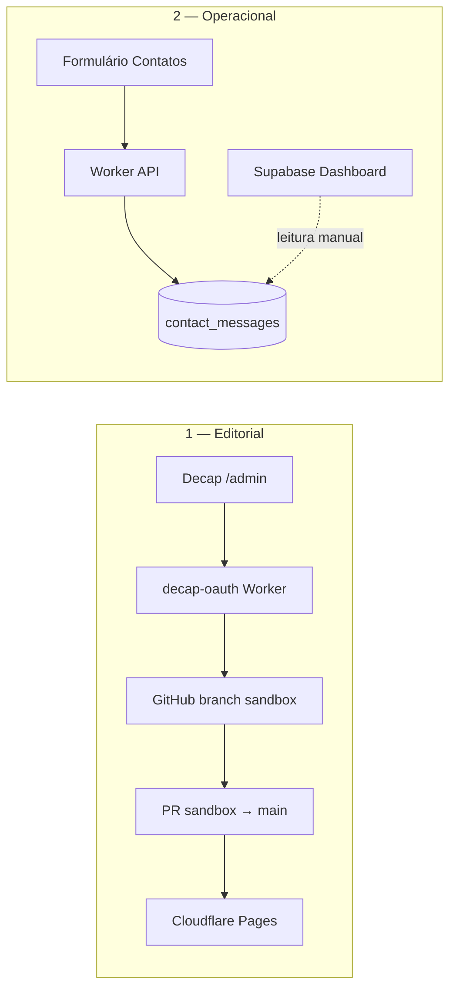

# Guia — Operações administrativas

How-to operacional das **duas superfícies admin** do portfólio.  
Base: ADR-0006 · ADR-0007 · ADR-0012 · `docs/architecture/system-guide.md` §8–10.

> **Regra:** conteúdo narrativo = Git. Mensagens de contato = Postgres. **Sem** painel JWT único.

---

## Mapa rápido



| Superfície | URL / ferramenta | O que gerencia | Fonte de verdade |
| --- | --- | --- | --- |
| **Editorial** | `/admin` (Decap) | CV, projetos, credenciais, canais | `apps/web/content/*.json` no Git |
| **Operacional** | Supabase Table Editor | Mensagens recebidas pelo site | `contact_messages` (Postgres) |

---

## 1. Admin editorial (Decap CMS)

### Quando usar

- Editar textos, projetos, certificações ou canais **no browser** sem abrir o IDE.
- Alternativa válida: sempre editar JSON no IDE + PR ([content.md](./content.md) fluxo A).

### Fluxo passo a passo

1. Abra [https://kleilson-portfolio.pages.dev/admin/](https://kleilson-portfolio.pages.dev/admin/).
2. **Login with GitHub** → popup → Worker `kleilson-decap-oauth` → token via `postMessage`.
3. Edite a collection (Perfil, Projetos, Credenciais, Contato).
4. **Publish** → commit direto na branch **`sandbox`** (`publish_mode: simple` — [Decap docs](https://decapcms.org/docs/configuration-options/)).
5. Abra ou atualize PR **`sandbox` → `main`** ([git-workflow.md](./git-workflow.md)).
6. CI verde → merge → deploy Pages publica o novo conteúdo.

```text
Editor → Decap → commit sandbox → PR → main → CI → Pages
```

### Setup OAuth (uma vez)

Detalhe em [content.md](./content.md#fluxo-b--decap-cms-opcional). Resumo:

| Passo | Onde |
| --- | --- |
| GitHub OAuth App | Callback: `https://kleilson-decap-oauth.kleilsonsantos.workers.dev/callback` |
| Secrets Worker | `GITHUB_CLIENT_ID`, `GITHUB_CLIENT_SECRET` via `wrangler secret put` |
| Config Decap | `apps/web/public/admin/config.yml` → `base_url` do Worker |

Evidência: `apps/decap-oauth/src/index.ts`, [Decap OAuth proxy](https://decapcms.org/docs/backends-overview/#using-github-with-an-oauth-proxy).

### Checklist pós-publicação (Decap)

- [ ] Commit apareceu em `sandbox` (não em `main`).
- [ ] PR `sandbox` → `main` aberto/atualizado com evidência (CV / LinkedIn / GitHub).
- [ ] `pnpm lint` · `pnpm typecheck` · `pnpm test` · `pnpm build` OK no PR.
- [ ] Smoke visual no preview do PR ou em Pages após merge.

### Troubleshooting editorial

| Sintoma | Causa provável | Ação |
| --- | --- | --- |
| Login GitHub falha | OAuth App / secrets / callback URL | Conferir [content.md](./content.md) + secrets Wrangler |
| Publish sem efeito no site | Commit só em `sandbox` | Merge PR para `main` |
| CI vermelho após Decap | JSON inválido | Ver erros do teste `content` (Zod) no job `quality` |
| Campo sumiu na UI | `config.yml` ≠ JSON | Alinhar `public/admin/config.yml` e schema Zod |

---

## 2. Admin operacional (mensagens de contato)

### Quando usar

- Ler mensagens enviadas pelo formulário **Contatos** em produção ou dev com DB real.

### Fluxo canônico (hoje)

1. Visitante envia formulário → `POST /api/contact` ([Worker prod](../architecture/system-guide.md) ou Fastify local).
2. API valida (`packages/shared`) e insere em `contact_messages` via `service_role` / Drizzle.
3. **Leitura:** Supabase → **Table Editor** → `contact_messages`.

Procedimento de smoke: [deploy.md](./deploy.md#passo-5--smoke-de-produção).

> **Não existe** rota HTTP pública `GET` para listar mensagens.  
> Evidência: `listContacts()` no Fastify **sem** rota exposta (`system-guide.md` §10).

### Por que não painel web custom

| Abordagem | Status | Motivo |
| --- | --- | --- |
| Supabase Dashboard | ✅ **Canônico** | Zero código; `service_role` nunca no browser |
| API `GET /contacts` + SPA | ❌ Rejeitado | Superfície de ataque; ADR-0006 RLS deny-by-default |
| Admin JWT/`localStorage` | ❌ Rejeitado | Regressão ADR-0007 (site antigo) |
| Narrativa no Supabase | ❌ Rejeitado | Segunda fonte de verdade |

Referência: [Supabase RLS](https://supabase.com/docs/guides/database/postgres/row-level-security) · [API keys](https://supabase.com/docs/guides/getting-started/api-keys).

### Checklist operacional (contato)

- [ ] Mensagem de teste aparece no Table Editor após smoke.
- [ ] Nenhum secret `service_role` em `VITE_*` ou no frontend.
- [ ] Resposta ao visitante fora do app (e-mail manual) — **notificação automática: Ainda não implementado** ([#122](https://github.com/KleilsonSantos/kleilson-portfolio/issues/122)).

---

## 3. O que não fazer (nunca)

- ❌ Recriar `/admin` com JWT, Firebase ou `localStorage`
- ❌ `PUT` de conteúdo narrativo na API sem PR
- ❌ Apontar Decap para `main` (bypass de review)
- ❌ Gravar profile/projetos no Supabase
- ❌ Expor `GET /api/contact` no browser

---

## 4. Melhorias planejadas (issues)

| Issue | Escopo | Status |
| --- | --- | --- |
| [#119](https://github.com/KleilsonSantos/kleilson-portfolio/issues/119) | Validação Zod + Vitest nos JSON | ✅ `src/schemas/content.ts` |
| [#120](https://github.com/KleilsonSantos/kleilson-portfolio/issues/120) | Este runbook | ✅ `docs/guides/admin-operations.md` |
| [#122](https://github.com/KleilsonSantos/kleilson-portfolio/issues/122) | Notificação e-mail/webhook | Ainda não implementado |
| [#123](https://github.com/KleilsonSantos/kleilson-portfolio/issues/123) | E2E smoke `/admin` | Ainda não implementado |

### Por que manter `publish_mode: simple`

Para **autor único**, commits diretos em `sandbox` + PR humano para `main` alinham ao fluxo Git (ADR-0002).  
`editorial_workflow` do Decap cria PR por entrada — útil para times, overhead desnecessário aqui ([Decap Editorial Workflows](https://decapcms.org/docs/editorial-workflows/)).

---

## Referências

- [content.md](./content.md) — edição de conteúdo
- [deploy.md](./deploy.md) — smoke produção
- [api.md](./api.md) — contrato `POST /api/contact`
- [ADR-0007](../adr/0007-content-as-code.md) · [ADR-0012](../adr/0012-decap-cms-git-backed.md) · [ADR-0006](../adr/0006-supabase-drizzle-contact.md)
- [system-guide.md](../architecture/system-guide.md) — estudo completo

## Relacionados

- [onboarding.md](./onboarding.md)
- [git-workflow.md](./git-workflow.md)
- [credentials.md](./credentials.md)
