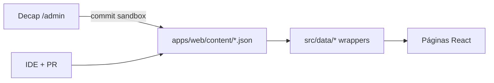

# Guia — Conteúdo do portfólio (Content-as-Code + Decap opcional)

How-to operacional do [ADR-0007](../adr/0007-content-as-code.md) + [ADR-0012](../adr/0012-decap-cms-git-backed.md).

## Fonte de verdade



| Domínio | Arquivo JSON (editável) | Wrapper TS | Página |
| --- | --- | --- | --- |
| Perfil, summary, skills, soft skills, experiência | `apps/web/content/profile.json` | `apps/web/src/data/profileData.ts` | Home, Sobre |
| Projetos | `apps/web/content/projects.json` | `apps/web/src/data/projectsData.ts` | Projetos |
| Credenciais / educação / cursos | `apps/web/content/credentials.json` | `apps/web/src/data/credentialsData.ts` | Sobre |
| Contato / canais / redes | `apps/web/content/contact.json` | `apps/web/src/data/contactData.ts` | Contatos |

Tipos: `apps/web/src/types/index.ts`.

**Não** gravar narrativa profissional no Supabase. Postgres (ADR-0006) = apenas mensagens de contato.

## Fluxo A — editar no IDE (sempre válido)

1. Issue → branch `feature/*` from `sandbox`.
2. Editar JSON em `apps/web/content/` (ou wrappers só se tipos mudarem).
3. Evidência no PR (CV / GitHub / LinkedIn).
4. PR → `sandbox` → `main`.

## Fluxo B — Decap CMS (opcional)

UI: [https://kleilson-portfolio.pages.dev/admin/](https://kleilson-portfolio.pages.dev/admin/)

1. Login com GitHub (OAuth via Worker `kleilson-decap-oauth`).
2. Editar collections (profile / projects / credentials / contact).
3. Publish → **commit em `sandbox`**.
4. Abrir/atualizar PR `sandbox` → `main`; CI gateia.

### Setup OAuth (uma vez)

1. GitHub → Settings → Developer settings → **OAuth Apps** → New:
   - Homepage: `https://kleilson-portfolio.pages.dev`
   - Callback: `https://kleilson-decap-oauth.kleilsonsantos.workers.dev/callback`
2. Deploy proxy:
   ```bash
   pnpm --filter @kleilson/decap-oauth exec wrangler secret put GITHUB_CLIENT_ID
   pnpm --filter @kleilson/decap-oauth exec wrangler secret put GITHUB_CLIENT_SECRET
   pnpm --filter @kleilson/decap-oauth deploy
   ```
3. Confirme `base_url` em `apps/web/public/admin/config.yml`.

## Checklist antes do PR

- [ ] Fato profissional tem fonte verificável?
- [ ] Datas/cargos/clientes não inventados?
- [ ] Cursos Udemy **não** listados como certificação vendor?
- [ ] Links abrem e estão atualizados?
- [ ] `pnpm lint` / `pnpm typecheck` / `pnpm test` / `pnpm build` OK?

## Validação CI (Zod)

Schemas em `apps/web/src/schemas/content.ts` espelham os JSON editáveis. Teste: `apps/web/src/data/content.test.ts` (job `quality`).

| Decap widget | Zod (resumo) |
| --- | --- |
| `string` | `z.string().min(1)` |
| `text` | `z.string()` (+ `.min(n)` onde aplicável) |
| `number` | `z.number().int()` |
| `boolean` | `z.boolean()` |
| `list` | `z.array(...)` |
| `object` | `z.object({...})` |
| `select` (ex. Udemy) | `z.literal('Udemy')` |

## O que não fazer

- ❌ Recriar `/admin` com JWT/`localStorage` ou Firebase keys
- ❌ `PUT` de conteúdo em API que publique sem PR
- ❌ Apontar Decap para `main` (bypass de review)
- ❌ Conteúdo narrativo no Supabase

## Referências

- [ADR-0007](../adr/0007-content-as-code.md) · [ADR-0012](../adr/0012-decap-cms-git-backed.md)
- [Decap backends](https://decapcms.org/docs/backends-overview/)
- [OpenGitOps](https://opengitops.dev/)

## Relacionados

- [credentials.md](./credentials.md) — política de certificados
- [onboarding.md](./onboarding.md) — setup
- [deploy.md](./deploy.md) — publicar (conteúdo ≠ deploy)
- [admin-operations.md](./admin-operations.md) — runbook editorial + operacional
- [git-workflow.md](./git-workflow.md) — PR com evidência
