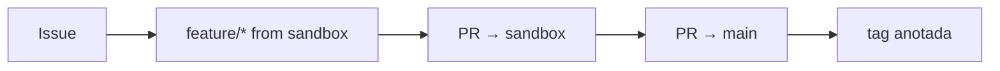

# Guia de Fluxo Git — Branches, PRs e Releases

Este documento define o fluxo oficial do repositório `kleilson-portfolio`.

## Visão geral

```text
┌─────────────────────────────────────────────────────────┐
│  Branches semânticas (trabalho isolado)                 │
│  feature/*  fix/*  docs/*  chore/*  ci/*  refactor/*   │
└───────────────────────────┬─────────────────────────────┘
                            │  Pull Request #1
                            ▼
                    ┌───────────────┐
                    │    sandbox    │  ← integração + CI
                    └───────┬───────┘
                            │  Pull Request #2 (após validação)
                            ▼
                    ┌───────────────┐
                    │     main      │  ← produção
                    └───────┬───────┘
                            │  Passo canônico (releaseable)
                            ▼
              tag anotada vX.Y.Z + GitHub Release
              (CHANGELOG + package.json alinhados)
```

## Branches permanentes

| Branch | Papel |
|--------|-------|
| `main` | Código em produção. Apenas merges via PR de `sandbox`. |
| `sandbox` | Integração contínua. Recebe PRs de branches semânticas. |

## Branches temporárias (semânticas)

Crie a partir de `sandbox` (atualizada):

```bash
git checkout sandbox
git pull origin sandbox
git checkout -b feature/nome-da-feature
```

### Prefixos aceitos

`feature/` · `fix/` · `bugfix/` · `hotfix/` · `refactor/` · `docs/` · `test/` · `chore/` · `build/` · `ci/` · `perf/` · `style/`

### Exemplos

```text
feature/typescript-migration
fix/contact-form-validation
docs/git-workflow-guide
ci/lighthouse-pipeline
chore/dependabot-config
```

## Fluxo de trabalho (passo a passo)

> **Kickoff canônico:** todo início de tarefa segue [`task-kickoff.md`](./task-kickoff.md) — issue → Project **In Progress** → branch `feature/*` from `sandbox`.

### 1. Iniciar tarefa (canônico)

```bash
# 1. Mover issue para "In Progress" no GitHub Project #6
# 2. Branch a partir de sandbox
git checkout sandbox && git pull origin sandbox
git checkout -b feature/nome-da-tarefa
# 3. Comentar na issue com a branch criada
gh issue comment <NUMERO> --repo KleilsonSantos/kleilson-portfolio \
  --body "🚀 Kickoff: branch \`feature/nome-da-tarefa\` criada."
```

### 2. Desenvolver com commits semânticos

```bash
git add .
git commit -m "feat: ✨ descrição objetiva do que e por quê"
```

**Formato obrigatório:** `type: <gitmoji> descrição`  
**Gitmoji de referência:** ✨ feat · 🐛 fix · ♻️ refactor · 📝 docs · 🔧 chore · 🚀 deploy · ⚡ perf · 🔒 security · ✅ test · 🎨 style · 🔥 remove · 🏗️ build · 👷 ci · 🔀 merge

**Autoria (obrigatória):** `Kleilson Santos <kdsddesign1@gmail.com>`  
**Proibido:** `Co-authored-by: Cursor`, `cursoragent@cursor.com`, ou qualquer trailer/assinatura de IDE/agente. O commit é do autor do projeto.  
No Cursor IDE: desative **Settings → Agent → Attribution** (co-author automático).

Hook local (recomendado):

```bash
git config core.hooksPath .githooks
```

O CI (`commitlint`) rejeita PRs cujos commits no range não tenham gitmoji.

### 3. Push e PR para sandbox

```bash
git push -u origin feature/minha-tarefa
gh pr create --base sandbox --head feature/minha-tarefa \
  --title "feat: ✨ título semântico" \
  --body "Resumo, contexto técnico e test plan."
```

Aguarde CI passar → revise → **merge com subject gitmoji** → delete a branch:

```bash
gh pr merge <N> --merge \
  --subject "merge: 🔀 PR #<N> — <branch>"
```

Não usar o subject padrão `Merge pull request #…` (sem emoji).

### 4. PR de sandbox para main

Após integração validada em `sandbox`:

```bash
gh pr create --base main --head sandbox \
  --title "release: 🚀 integração sandbox → main" \
  --body "Release notes e checklist de validação."
```

Aguarde CI → merge com subject gitmoji:

```bash
gh pr merge <N> --merge --subject "merge: 🔀 PR #<N> — sandbox"
```

### 5. Tag SemVer + GitHub Release (passo canônico)

**Obrigatório** após merge em `main` quando a entrega for releaseable (marco de fase, feature user-facing, ou bump documental de versão). Não deixar `CHANGELOG`/`package.json` à frente da última tag.

```bash
git checkout main && git pull origin main

# Pré-requisitos no código (já mergeados):
# - CHANGELOG: [Unreleased] promovido para [X.Y.Z] - data
# - package.json "version": "X.Y.Z"

git tag -a vX.Y.Z -m "vX.Y.Z — descrição da release"
git push origin vX.Y.Z
gh release create vX.Y.Z \
  --title "vX.Y.Z — título" \
  --notes "Ver CHANGELOG seção [X.Y.Z]."
```

Checklist rápido:

- [ ] `main` atualizada e CI verde no PR sandbox→main
- [ ] Versão no CHANGELOG = tag = `package.json`
- [ ] Tag **anotada** (`-a`), não leve
- [ ] GitHub Release publicado
- [ ] README “Última release” aponta para a tag nova

Detalhes e histórico: [`releases.md`](./releases.md)

## Versionamento SemVer

| Versão | Significado | Exemplo neste projeto |
|--------|-------------|----------------------|
| `v0.1.0` | Fase 1 — Frontend Foundation | ✅ Publicada |
| `v0.1.1` | Git workflow enterprise | ✅ Publicada |
| `v0.2.0` | Fase 2 — TypeScript strict | ✅ Publicada |
| `v0.2.1` | Sync de documentação | ✅ Publicada |
| `v0.2.2` | ADR-0003 documentação | ✅ Publicada |
| `v0.3.0` | Qualidade + visual + AI + Fastify | ✅ Publicada |
| `v0.4.0` | Fase 3 — Supabase + Drizzle (#7) | ✅ Publicada |
| `v0.4.0+` / próximo SemVer | Deploy Pages + Workers Free (#8), Sentry (#9), Umami (#65), monorepo (#10), Decap (#71) | ✅ No `main` (CHANGELOG Unreleased — tag SemVer pendente) |

## Fluxo (resumo)



## O que NÃO fazer

- ❌ Commit direto em `main`
- ❌ Commit direto em `sandbox` sem PR
- ❌ PR de `feature/*` direto para `main` (pular sandbox)
- ❌ Commits genéricos (`update`, `fix stuff`, `wip`)
- ❌ Commits/merges sem gitmoji (`docs: polish…`, `Merge pull request #…`)
- ❌ Tags sem mensagem anotada

## CI/CD

O pipeline roda em:

- Push para `sandbox` e `main`
- Pull Requests para `sandbox` e `main`

## Exceção histórica

Os commits iniciais da Fase 1 foram feitos diretamente em `main` durante o bootstrap. A tag `v0.1.0` marca esse marco. **A partir de v0.1.1**, todo desenvolvimento segue este guia.

## Relacionados

- [task-kickoff.md](./task-kickoff.md) — kickoff canônico
- [releases.md](./releases.md) — tags e SemVer
- [documentation-sync.md](./documentation-sync.md) — docs no mesmo PR
- [ADR-0002](../adr/0002-git-branching-strategy.md)
- [CONTRIBUTING.md](../../CONTRIBUTING.md)
- [SUPPORT.md](../../SUPPORT.md)
